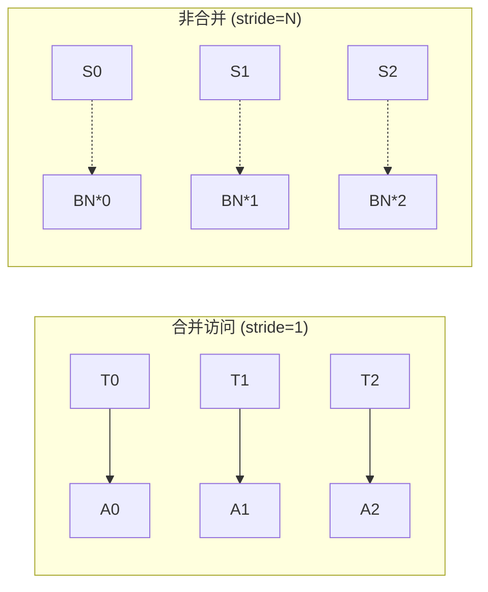

+++
title = 'CUDA 内存合并访问：从直觉到指标'
date = 2026-07-09
draft = false
summary = '用一次矩阵读取讲清楚 memory coalescing，以及如何用 NCU 验证带宽利用率。'
tags = ['CUDA', '性能优化']
math = true
+++

## 为什么合并访问重要

GPU 的全局内存带宽远高于计算访存比所能"喂饱"的速度。一个 warp（32 个线程）发起一次访存请求时，如果这 32 个地址落在**同一段连续内存**上，硬件可以用最少的总线事务完成——这就是**合并访问（coalesced access）**。

否则，一次逻辑访存会被拆成多次总线事务，带宽利用率骤降。

## 一个对比例子

### 不合并：按列读取

```cuda
// 每个线程读 A[col][tid]，相邻线程地址跨度 = 一整列
__global__ void bad_read(float* A, float* out, int N) {
    int tid = threadIdx.x + blockIdx.x * blockDim.x;
    out[tid] = A[tid * N];  // stride = N，极不合并
}
```

### 合并：按行读取

```cuda
// 相邻线程读相邻地址
__global__ void good_read(float* A, float* out, int N) {
    int tid = threadIdx.x + blockIdx.x * blockDim.x;
    out[tid] = A[tid];  // stride = 1，完全合并
}
```

## 理论带宽利用率

对于合并访问，一个 warp 的一次 32-bit load 理论上对应 $128$ 字节（$32 \times 4$）的有效传输。有效带宽利用率可近似为：

$$
\eta = \frac{\text{有效字节}}{\text{实际传输字节}} \in [0, 1]
$$

当 stride 远大于 1 时，$\eta \to 0$。

## 访存模式示意



## 用 NCU 验证

```bash
ncu --set memory --target-processes all ./my_kernel
```

关注 `gpc__cycles_elapsed.max` 和 `dram__bytes_read.sum.per_second`，换算出实测带宽，与硬件峰值（如 A100 的 $1.55$ TB/s）对比。

## 小结

- 合并访问是 CUDA 性能优化的**第一课**，几乎决定了一切带宽受限 kernel 的上限。
- 判断方法：相邻线程的地址差是否为 1。
- 验证工具：`ncu` 的 memory set。
