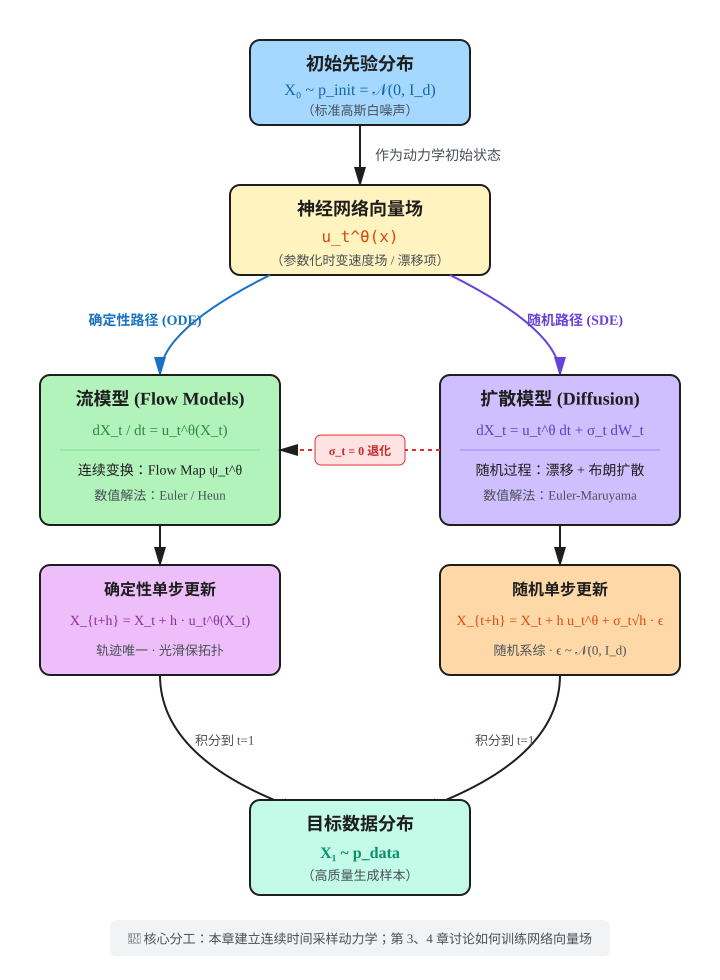
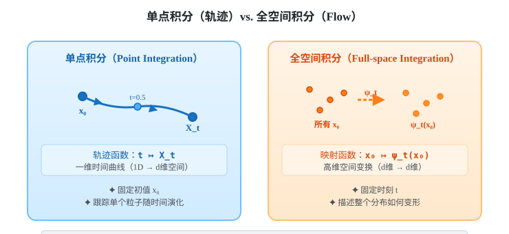
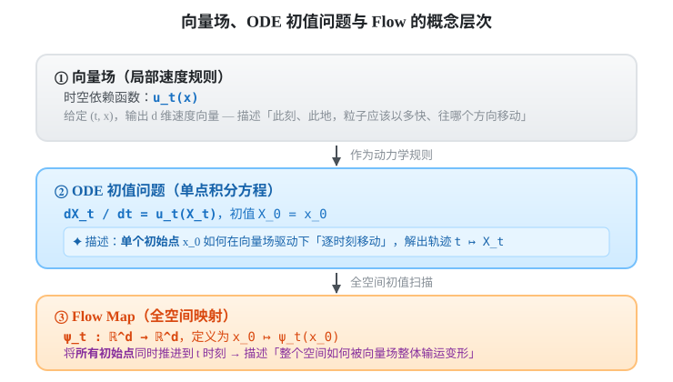
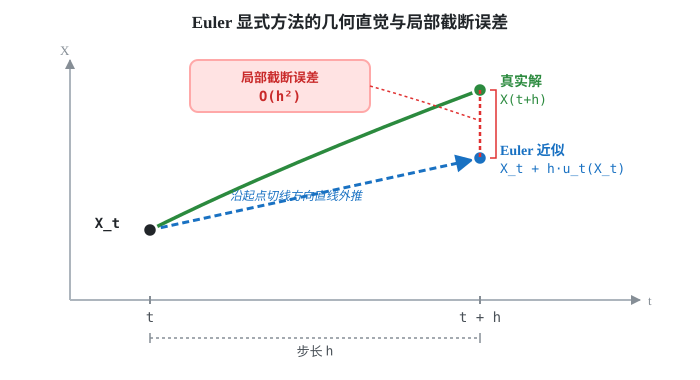
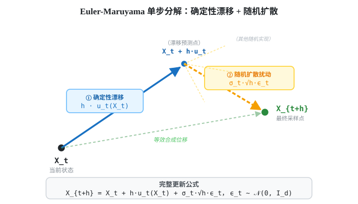

+++
title = 'MIT 6.S184: Flow Matching and Diffusion Models — 第 2 章：流模型与扩散模型'
date = 2026-09-01
draft = false
summary = '深入解析连续时间生成模型的基础范式：从向量场定义、ODE 与 Flow 映射，到布朗运动、SDE 随机动力学及数值模拟（Euler 与 Euler-Maruyama 方法），建立确定性流与随机扩散的统一视角。'
tags = ['Diffusion Models', 'Flow Matching', 'ODE', 'SDE', '生成建模']
showReadingTime = true
showTableOfContents = true
+++



> **[MIT 6.S184: Flow Matching and Diffusion Models](https://diffusion.csail.mit.edu/)** 课程笔记

> 🎯 **本章一句话总结：** 生成模型可以被构造为一个从简单先验分布 $p_{\mathrm{init}}$ 出发、沿神经网络定义的向量场，通过 ODE（确定性流）或 SDE（随机扩散）演化，最终得到数据分布 $p_{\mathrm{data}}$ 样本的采样器。

---

## 学习目标

**理解层面**

- 深刻理解向量场（时变速度场）、ODE 轨迹（单粒子运动路径）与 Flow Map（全空间连续变换）三者的数学定义与物理直觉。
- 理解布朗运动（Wiener Process）的随机性本质，掌握增量方差与时间差成正比的核心性质。
- 区分确定性动力学（ODE）与随机动力学（SDE）在生成建模中的机制与表现。

**建模与表示层面**

- 能写出流模型的常微分方程（ODE）与扩散模型的随机微分方程（Itô SDE）。
- 理解为什么神经网络参数化的是**向量场** $u_t^\theta(x)$，而不是直接参数化 Flow Map $\psi_t(x)$。
- 掌握如何通过设定边界条件，实现从标准高斯分布 $X_0 \sim p_{\mathrm{init}} = \mathcal{N}(0, I_d)$ 到数据分布 $X_1 \sim p_{\mathrm{data}}$ 的连续概率输运。

**数值模拟与算法层面**

- 掌握用于求解 ODE 的 Euler 显式方法与 Heun 预估-校正法。
- 掌握用于模拟 SDE 的 Euler-Maruyama 算法，并能从数学上解释为什么单步注入的高斯噪声尺度必须是 $\sigma_t \sqrt{h}$ 而非 $\sigma_t h$。

**架构统一层面**

- 能从统一视角审视流模型与扩散模型，证明流模型本质上是扩散模型在扩散系数 $\sigma_t = 0$ 时的无噪声退化特例。
- 清楚划分「连续时间采样动力学（本章）」与「向量场学习训练（第 3、4 章）」的职责边界。

---

## 章节主线

### 承上启下：从「目标定义」到「动力学构造」

在第 1 章中，我们将生成建模严格表述为概率采样问题：从未知的高维数据分布 $p_{\mathrm{data}}$ 中采样出合理且多样的样本 $z \sim p_{\mathrm{data}}$。然而，第 1 章留下了最关键的悬念——**在 $p_{\mathrm{data}}$ 形式完全未知且无法显式求值的情况下，我们该如何构造一个可计算的采样器？**

本章正式给出连续时间生成模型的核心答案：
1. **构造输运通道**：将采样问题转化为粒子在连续时间 $t \in [0, 1]$ 上的位置演化过程。
2. **选择动力系统**：
   - 若采用确定性平滑流动，即为**流模型（Flow Models / Continuous Normalizing Flows）**，底层由 ODE 驱动；
   - 若在流动中持续注入布朗热扰动，即为**去噪扩散模型（Diffusion Models）**，底层由 SDE 驱动。
3. **神经网络赋能**：用深度神经网络拟合时变向量场，引导粒子从最简单的纯高斯噪声逐步凝聚成高保真数据样本。

### 核心问题驱动链

| 核心问题 | 本章回答 | 对应小节 |
|:---|:---|:---|
| **如何描述高维样本在连续时间中的动态变化？** | 用向量场 $u_t(x)$ 规定每个时刻、每个空间位置处的瞬时速度。 | 2.1.1 |
| **如何求得样本从噪声到数据的具体运动轨迹？** | 给定初始点 $X_0$，求解由向量场定义的常微分方程（ODE）初值问题。 | 2.1.1 & 2.1.2 |
| **如何把所有可能初始点到终点的映射统一起来？** | 引入流映射（Flow Map）$\psi_t(x)$，它构成空间上的连续微分同胚变换。 | 2.1.2 |
| **计算机如何数值求解不可解析的连续轨迹？** | 采用 Euler 方法或 Heun 预估-校正法沿时间网格逐步积分。 | 2.1.4 |
| **为什么选择参数化向量场而非直接拟合 Flow 映射？** | 局部速度函数无拓扑与可逆性硬约束，表达能力更强且无需计算高维逆映射。 | 2.1.5 |
| **如何在生成过程中引入受控的随机探索？** | 在确定性漂移速度之外，添加由布朗运动驱动的随机项，构建随机微分方程（SDE）。 | 2.2.1 – 2.2.3 |
| **SDE 的数值采样算法与离散尺度如何确定？** | 采用 Euler-Maruyama 算法，因布朗运动方差与时间线性相关，单步噪声尺度为 $\sqrt{h}$。 | 2.2.5 & 2.2.6 |
| **流模型与扩散模型的深层本质关系是什么？** | 流模型是扩散模型的零扩散特例（$\sigma_t \to 0$）；两者共享相同的向量场网络骨架。 | 2.3 |

### 本章逻辑全景流图



---

## 2.1 流模型（Flow Models）

### 2.1.1 向量场、ODE 与轨迹

要让空间中的点平滑移动，最直接的数学工具是**时变向量场（Time-dependent Vector Field）**。

#### 1. 向量场的数学定义
向量场是一个在空间和时间上的多元向量值函数：

$$
u: \mathbb{R}^d \times [0,1] \to \mathbb{R}^d,\qquad (x,t) \mapsto u_t(x)
$$

对于给定的时间 $t \in [0, 1]$ 和空间坐标 $x \in \mathbb{R}^d$，$u_t(x)$ 输出一个 $d$ 维速度向量。

> 💡 **直觉图景：** 可以将 $d$ 维空间想象为一条河流。在任意时刻 $t$，河流中的每一个位置 $x$ 都插着一个箭头：箭头的朝向指示水流方向，箭头的长度表示流速大小。向量场 $u_t(x)$ 就是整条河流在时刻 $t$ 的流速分布图。

#### 2. 常微分方程（ODE）与初值问题
如果我们在时刻 $t=0$ 将一个无质量的粒子放置在初始位置 $X_0 = x_0$，让它完全顺着水流漂移，则粒子的运动遵循常微分方程（Ordinary Differential Equation, ODE）：

$$
\frac{dX_t}{dt} = u_t(X_t),\qquad X_0 = x_0
$$

各项的物理与数学含义如下：
- $X_t \in \mathbb{R}^d$：粒子在时刻 $t$ 所处的空间坐标；
- $\frac{dX_t}{dt}$：粒子在时刻 $t$ 的瞬时物理速度；
- $u_t(X_t)$：向量场在粒子当前所在位置 $X_t$ 处给出的速度指令；
- $X_0 = x_0$：初始边界条件。

> 💡 **核心直觉：** ODE 并没有预先画出一条死板的轨道，它只给出了局部规则——**「粒子当前位置的运动速度，必须严格等于当前位置处向量场指示的速度」**。沿着这些速度一步步连缀出来的连续曲线，就是该初值问题的**解轨迹（Trajectory）** $t \mapsto X_t$。

---

### 2.1.2 Flow（流映射）是什么

ODE 的单条解描述的是**单个特定初始点**的行进路径。如果我们要考察**全空间所有初始点**如何被整体输运，就需要引入 **Flow Map（流映射）** 的概念。

#### 1. Flow Map 的定义
对于任意初始点 $x_0 \in \mathbb{R}^d$，ODE 都会生成一条唯一的轨迹。我们将「把初始点 $x_0$ 映射到其在时刻 $t$ 所处位置」的函数定义为 Flow Map：

$$
\psi_t: \mathbb{R}^d \to \mathbb{R}^d,\qquad x_0 \mapsto \psi_t(x_0)
$$

Flow Map 与向量场之间满足核心微分关系：

$$
\frac{d}{dt}\psi_t(x_0) = u_t(\psi_t(x_0)),\qquad \psi_0(x_0) = x_0
$$

根据定义，时刻 $t$ 的粒子位置即为 Flow Map 的输出：

$$
X_t = \psi_t(X_0)
$$

两种积分视角的对比如下：



#### 2. 向量场、ODE 与 Flow 的严格概念区分

在很多文献中，「向量场定义 ODE，其解即为 Flow」常被用作简要概括。但在深入实现与算法设计时，必须严格区分三者的层次：



#### 3. Flow Map 的几何与拓扑性质
在数学物理中，只要向量场 $u_t(x)$ 满足 Lipschitz 连续性与导数有界条件，根据 Picard-Lindelöf 定理：
- **存在性与唯一性**：从任意点 $x_0$ 出发的轨迹存在且唯一；
- **轨迹不相交**：在扩展时空空间中，不同初始点出发的轨迹绝不会相交或合并；
- **微分同胚（Diffeomorphism）**：$\psi_t$ 是一个光滑可逆的双射。它在几何上表现为对整个空间进行连续的拉伸、压缩和扭曲，但绝不会撕裂空间或将两个不同点强行重合。

---

### 2.1.3 线性向量场示例与解析推导

为了建立具象的数学感知，我们考察一维线性收缩向量场。

#### 1. 向量场与 ODE 设定
设标量常数 $\theta > 0$，定义线性向量场：

$$
u_t(x) = -\theta x
$$

对应的 ODE 初值问题为：

$$
\frac{dX_t}{dt} = -\theta X_t,\qquad X_0 = x_0
$$

#### 2. 解析求解
这是一个经典的一阶线性常微分方程，采用分离变量法积分：

$$
\frac{dX_t}{X_t} = -\theta \, dt \implies \int_{0}^t \frac{dX_s}{X_s} = \int_{0}^t -\theta \, ds
$$

$$
\ln\left(\frac{X_t}{x_0}\right) = -\theta t \implies X_t = x_0 e^{-\theta t}
$$

#### 3. 得到 Flow Map
由此可直接写出该系统的 Flow Map：

$$
\psi_t(x_0) = x_0 e^{-\theta t}
$$

#### 4. 验证相容性
求导验证 Flow 是否满足定义：

$$
\frac{d}{dt}\psi_t(x_0) = \frac{d}{dt}\left(x_0 e^{-\theta t}\right) = -\theta x_0 e^{-\theta t} = -\theta \psi_t(x_0) = u_t(\psi_t(x_0))
$$

同时满足初始恒等条件 $\psi_0(x_0) = x_0 e^0 = x_0$。

> 🔍 **几何直觉：** 在这个系统中，原点 $x=0$ 是全局吸引子。无论初始点 $x_0$ 在何处，随着时间 $t$ 推进，点都以指数速度向原点靠拢。空间整体在发生均匀收缩。

---

### 2.1.4 ODE 的数值模拟方法

在实际生成任务中，深度神经网络拟合的向量场 $u_t^\theta(x)$ 是高度非线性的高维黑盒函数，**无法求出解析解**。我们必须依赖数值 ODE 求解器（ODE Solvers）在离散时间网格上进行近似积分。

将时间区间 $[0, 1]$ 划分为 $n$ 个步长为 $h = 1/n$ 的离散时间点：$0 = t_0 < t_1 < \dots < t_n = 1$。

#### 1. Euler 显式方法（一阶法）
Euler 方法是最基础、最直观的数值积分算法：用当前点处的切线方向代替整段区间的速度。

$$
X_{t+h} = X_t + h \, u_t(X_t)
$$

其执行步骤极为简洁：
1. 在当前位置 $X_t$ 计算神经网络向量场速度 $u_t(X_t)$；
2. 沿着该速度方向直线推移一个微小时间步长 $h$；
3. 将得到的位置作为下一步的起点 $X_{t+h}$，重复推进直到 $t=1$。



Euler 方法的局部截断误差为 $\mathcal{O}(h^2)$，全局累积误差为 $\mathcal{O}(h)$。

#### 2. Heun 方法（二阶预估-校正法）
当速度场曲率较大时，单纯使用起点切线会产生累积漂移。Heun 方法采用「先预估、再平均校正」的思想：

- **第一步（预估步）**：使用 Euler 方法预测终点候选位置 $X'_{t+h}$：
  $$
  X'_{t+h} = X_t + h \, u_t(X_t)
  $$
- **第二步（校正步）**：计算预测终点处的速度向量 $u_{t+h}(X'_{t+h})$，取起点与终点速度的算术平均值作为整步的等效速度：
  $$
  X_{t+h} = X_t + \frac{h}{2} \left[ u_t(X_t) + u_{t+h}(X'_{t+h}) \right]
  $$

Heun 方法具有二阶全局精度 $\mathcal{O}(h^2)$，能以更少的步数达到更高的生成保真度，代价是每个时间步需要评估两次神经网络。

---

### 2.1.5 基于神经网络的流模型

有了向量场与 ODE 求解器，我们便可以形式化定义流模型（Flow Models）。

#### 1. 生成模型形式化
用可学习的深度神经网络 $u_t^\theta(x)$ 参数化时变向量场。流模型的采样生成流程定义如下：

$$
X_0 \sim p_{\mathrm{init}} = \mathcal{N}(0, I_d),\qquad \frac{dX_t}{dt} = u_t^\theta(X_t)
$$

模型训练的最终目标是：调整网络参数 $\theta$，使得经过时间 $t=1$ 的 ODE 积分演化后，终点样本的边缘分布精确逼近真实数据分布：

$$
X_1 = \psi_1^\theta(X_0) \sim p_{\mathrm{data}}
$$

#### 2. 为什么参数化「向量场」而非直接拟合「Flow 映射」？

这是流模型架构中最具洞见的设计考量：

| 考量维度 | 直接参数化 Flow 映射 $\psi^\theta(x)$ | 参数化向量场 $u_t^\theta(x)$（本课方案） |
|:---|:---|:---|
| **拓扑保真与可逆性** | 必须在网络结构上施加严苛限制（如 RealNVP/Coupling 层），严重削弱模型容量与表达力。 | 任意标准网络（U-Net、DiT）均可无约束使用；ODE 动力学天然保证了解的连续性与微分同胚性。 |
| **计算复杂度** | 计算对数似然或概率变换需要计算高维 Jacobian 行列式 $\det\left(\frac{\partial \psi}{\partial x}\right)$，计算开销巨大。 | 概率密度变化率由向量场的散度（Divergence）$\nabla \cdot u_t(x)$ 决定，可通过 Hutchinson 迹估计高效求解。 |
| **学习难度** | 跨越极大时间跨度的端到端映射极易陷入局部极小与模式坍塌。 | 局部速度场学习被分解到每个微小时间片，训练目标平滑稳定。 |

> ⚠️ **关键认知：** 神经网络输出的是**局部切向量** $u_t^\theta(x)$，而不是最终样本。完整的生成映射 $\psi_t^\theta$ 是通过 ODE 求解器在推理时数值积分动态合成的。

---

## 2.2 扩散模型（Diffusion Models）

### 2.2.1 从确定性演化到随机过程

ODE 流模型的演化是完全确定性的：**一旦初始噪声点 $X_0 = x_0$ 固定，随后的整条演化轨迹以及最终生成的图像 $X_1$ 就被完全锁定。**

去噪扩散模型（Denoising Diffusion Models）则采取了不同的动力学范式——在系统的演化过程中持续注入受控的随机扰动。由于随机噪声的存在，即便从同一个初始状态 $x_0$ 出发，多次模拟也会产生截然不同的随机路径系综。

此时，$X = (X_t)_{0 \le t \le 1}$ 在数学上被称为**连续时间随机过程（Stochastic Process）**：对每一个固定的时间点 $t$，$X_t$ 都是一个服从特定分布的高维随机变量。

---

### 2.2.2 布朗运动（Brownian Motion / Wiener Process）

在连续时间随机分析中，注入随机性的基石是**标准布朗运动（维纳过程，Wiener Process）** $W = (W_t)_{t \ge 0}$。

#### 1. 布朗运动的三大公理化性质
一个 $d$ 维随机过程 $W_t \in \mathbb{R}^d$ 被称为标准布朗运动，当且仅当满足：
1. **初始零值与轨迹连续**：$W_0 = 0$ 几乎必然成立，且样本轨道 $t \mapsto W_t$ 是连续函数；
2. **独立增量性**：对任意时间序列 $0 \le t_0 < t_1 < \dots < t_k$，各个时间段的位移增量 $W_{t_1}-W_{t_0}, W_{t_2}-W_{t_1}, \dots, W_{t_k}-W_{t_{k-1}}$ 相互统计独立；
3. **平稳高斯增量**：对于任意 $0 \le s < t$，位移增量服从以 $0$ 为均值、时间跨度为方差的各向同性高斯分布：
   $$
   W_t - W_s \sim \mathcal{N}\left(0, (t-s) I_d\right)
   $$

#### 2. 为什么单步噪声尺度是 $\sqrt{h}$ 而非 $h$？

在数值模拟中，若时间步长为 $h$，布朗运动的增量为：

$$
\Delta W_t = W_{t+h} - W_t = \sqrt{h} \, \epsilon_t,\qquad \epsilon_t \sim \mathcal{N}(0, I_d)
$$

很多初学者容易在此产生直觉困惑：**为什么确定性步长乘以 $h$，而随机噪声却乘以 $\sqrt{h}$？**

这是由高斯分布的方差叠加性质决定的：
- 考虑将时间跨度 $T$ 划分为 $n$ 个步长为 $h = T/n$ 的小区间。
- 在每个小区间注入独立高斯噪声 $\xi_i$。经过 $n$ 步累积后，总位移为 $\sum_{i=1}^n \xi_i$。
- 根据独立随机变量方差相加法则：
  $$
  \mathrm{Var}\left( \sum_{i=1}^n \xi_i \right) = \sum_{i=1}^n \mathrm{Var}(\xi_i) = n \cdot \mathrm{Var}(\xi)
  $$
- 我们要求经过总时间 $T$ 后，总扩散方差必须严格等于 $T$（即 $n \cdot h$）：
  $$
  n \cdot \mathrm{Var}(\xi) = n \cdot h \implies \mathrm{Var}(\xi) = h \implies \mathrm{Std}(\xi) = \sqrt{h}
  $$
- 若错误地设置单步噪声尺度为 $h \epsilon_t$，则总方差将变成 $n \cdot h^2 = n \cdot (T/n)^2 = T^2 / n \to 0$（当步数趋向无穷时随机性完全消失！）。

因此，**$\sqrt{h}$ 尺度是维持物理世界总扩散强度与离散步数无关的唯一正确尺度。**

---

### 2.2.3 随机微分方程（Itô SDE）：漂移加扩散

结合确定性向量场与布朗运动，我们得到描述扩散模型采样动力学的**随机微分方程（Stochastic Differential Equation, SDE）**。

#### 1. 离散演化直觉
从 ODE 的 Euler 离散形式出发，额外加入布朗扩散项：

$$
X_{t+h} = X_t + \underbrace{h \, u_t(X_t)}_{\text{确定性漂移}} + \underbrace{\sigma_t (W_{t+h} - W_t)}_{\text{随机扩散}} + \mathcal{O}(h)
$$

其中 $\sigma_t \ge 0$ 为随时间变化的扩散系数（Diffusion Coefficient），用于控制每个时刻注入随机扰动的强度。

#### 2. Itô SDE 标准形式
将时间步长 $h \to 0$ 取极限，得到连续时间的标准 Itô SDE 形式：

$$
dX_t = u_t(X_t) \, dt + \sigma_t \, dW_t,\qquad X_0 = x_0
$$

各项的物理意义分解：
- $u_t(X_t) \, dt$：**漂移项（Drift Term）**，代表宏观确定性引导力，驱使粒子沿着神经网络学习到的向量场向高密度数据区域汇集；
- $\sigma_t \, dW_t$：**扩散项（Diffusion Term）**，代表微观无规布朗运动，在每一点为系统注入各向同性的随机热扰动；
- $\sigma_t$：**噪声强度调度**，调节探索与收敛的平衡。

> 💡 **退化性质：** 当扩散系数恒等于零（$\sigma_t = 0$）时，扩散项消失，$dX_t = u_t(X_t)dt$ 完全退化为标准 ODE 流模型。因此，**流模型是扩散模型在零扩散极限下的特殊子集。**

---

### 2.2.4 Ornstein-Uhlenbeck (OU) 过程分析

Ornstein-Uhlenbeck 过程是理解 SDE 动力学最经典的线性模型。

#### 1. 系统定义
设回复系数 $\theta > 0$，恒定扩散强度 $\sigma > 0$，定义一维 OU 过程 SDE：

$$
dX_t = -\theta X_t \, dt + \sigma \, dW_t
$$

- 漂移项 $-\theta X_t dt$：像一根橡皮筋，始终产生将粒子拉向中心原点 $0$ 的均值回归力；
- 扩散项 $\sigma dW_t$：持续向系统注入高斯白噪声扰动。

#### 2. 极限稳态分析
当系统运行足够长时间后，向心的确定性拉力与向外的随机扩散达到动态平衡，系统的边缘分布会收敛到稳定的平衡高斯分布：

$$
X_\infty \sim \mathcal{N}\left(0, \frac{\sigma^2}{2\theta}\right)
$$

- 若 $\sigma = 0$：退化为 2.1.3 节的确定性收缩流，所有粒子最终坍缩至原点单一奇异点（方差为 0）；
- 若 $\sigma > 0$：粒子不会静止在原点，而是在原点周围形成具有恒定方差 $\frac{\sigma^2}{2\theta}$ 的稳态高斯云团。

---

### 2.2.5 Euler-Maruyama 随机数值积分

求解 SDE 最基础且应用最广的数值算法是 **Euler-Maruyama 方法**（即 Euler 方法在随机微积分中的推广）。

#### 1. 算法迭代公式
给定离散步长 $h = 1/n$，在每一步 $t$：

$$
X_{t+h} = X_t + h \, u_t(X_t) + \sigma_t \sqrt{h} \, \epsilon_t,\qquad \epsilon_t \sim \mathcal{N}(0, I_d)
$$



#### 2. 核心特征
与 ODE 的 Euler 法相比，Euler-Maruyama 法在每一个时间步都必须**独立重新抽取**高斯白噪声向量 $\epsilon_t$。因此，即使两次采样的初始噪声 $X_0$ 完全相同，由于积分过程中的随机数序列不同，最终生成的样本也会有所差异。

---

### 2.2.6 扩散模型连续生成算法流程

将上述组件组合，即可得到基于 SDE 的完整扩散模型采样生成算法：

```text
算法 1: 连续时间扩散模型采样（Euler-Maruyama 求解器）
──────────────────────────────────────────────────────────────────────────
输入: 神经网络向量场 u_t^θ(x)，扩散系数函数 σ_t，离散步数 n
输出: 生成的数据样本 X_1

1: 初始化时间步长 h ← 1/n，当前时间 t ← 0
2: 采样初始噪声: X_0 ~ p_init = 𝒩(0, I_d)
3: for i = 1 to n do
4:     采样独立标准高斯噪声: ϵ_t ~ 𝒩(0, I_d)
5:     计算漂移速度: v_t ← u_t^θ(X_t)
6:     执行 Euler-Maruyama 步进:
           X_{t+h} ← X_t + h · v_t + σ_t · √h · ϵ_t
7:     更新时间: t ← t + h
8: end for
9: return X_1
──────────────────────────────────────────────────────────────────────────
```

---

## 2.3 流模型与扩散模型的系统对比

为了建立清晰的宏观技术图景，下表从动力学、数学性质与工程实现维度对两者进行全方位对比：

| 比较维度 | 流模型（Flow Models） | 扩散模型（Diffusion Models） |
|:---|:---|:---|
| **底层动力系统** | 常微分方程（ODE）：$\frac{dX_t}{dt} = u_t(X_t)$ | 随机微分方程（SDE）：$dX_t = u_t(X_t)dt + \sigma_t dW_t$ |
| **轨迹几何特征** | **确定性平滑轨迹**；同一起点 $X_0$ 的解轨迹严格唯一。 | **随机分形轨迹**；同一起点多次模拟生成多样化路径系综。 |
| **单步离散更新** | $X_{t+h} = X_t + h \, u_t(X_t)$ | $X_{t+h} = X_t + h \, u_t(X_t) + \sigma_t \sqrt{h} \, \epsilon_t$ |
| **生成随机性来源** | **仅源自起点**：初始高斯采样 $X_0 \sim p_{\mathrm{init}}$。 | **双重随机性**：初始点 $X_0$ + 演化中每步注入的布朗噪声 $\epsilon_t$。 |
| **可逆性与反向推断** | 严格可逆：将 $h \to -h$ 即可从图像精确重建对应的潜在噪声。 | 不可逆（或需通过特定反向 SDE/概率流 ODE 近似重构）。 |
| **神经网络角色** | 参数化向量场 $u_t^\theta(x)$。 | 参数化向量场 $u_t^\theta(x)$（配合预定扩散系数 $\sigma_t$）。 |
| **内在统一关系** | 扩散模型在 $\sigma_t \to 0$ 时的**无噪声特例**。 | 流模型添加随机布朗扩散后的**随机推广**。 |

---

## 2.4 生成过程认知框架与高频混淆点

在学习连续时间生成动力学时，以下 7 个概念极其容易混淆，需建立明确的认知边界：

### 1. 向量场 $\neq$ 轨迹 $\neq$ Flow Map
- **向量场 $u_t(x)$** 是全空间的时空速度场（局部导数规则）；
- **轨迹 $t \mapsto X_t$** 是单个粒子在该速度场下走出的一维时空曲线；
- **Flow Map $x_0 \mapsto \psi_t(x_0)$** 是把全空间所有初始点映射到时刻 $t$ 的全局微分同胚变换。

### 2. ODE 是确定性的，为什么流模型能够生成多样的样本？
很多读者会产生误解：“既然 ODE 轨迹是唯一的，模型怎么可能生成千变万化的图像？”
答案在于**初始条件的随机性**：虽然对任何给定的 $x_0$ 演化是确定性的，但采样器是从高维标准高斯分布 $X_0 \sim \mathcal{N}(0, I_d)$ 中抽取初始点的。每一个不同的噪声向量 $x_0$，都会沿着互不交叉的流映射 $\psi_1^\theta(x_0)$ 抵达不同的数据样本点，从而完美复现整个数据分布的多样性。

### 3. 流模型并非直接由神经网络输出 Flow Map
深度网络直接输出的是局部向量场 $u_t^\theta(x)$，而不是全局变换 $\psi_t^\theta(x)$。完整的映射是通过数值积分器（如 Euler 算法）逐步累积计算得到的。

### 4. SDE 单步噪声必须是 $\sigma_t \sqrt{h} \epsilon$，绝不能写成 $\sigma_t h \epsilon$
布朗运动的物理本质是扩散过程，其在微小时间段 $h$ 内的位移方差正比于 $h$。因此位移标准差为 $\sqrt{h}$。写成 $h$ 会导致离散步数增多时扩散效应迅速归零。

### 5. 扩散模型不仅仅是「向数据加噪」
在传统直觉中，“扩散”常被视作单纯的加噪过程。但在连续时间生成模型中，SDE **同时包含定向漂移项与随机扩散项**。漂移项由神经网络向量场精确操控，负责从无序噪声中提炼结构信息，扩散项则提供随机跳跃与探索能力。

### 6. 生成动力学与模型训练的分工边界
**本章的核心任务是建立采样生成的形式体系**——即「假定我们已经拥有了一个理想的向量场 $u_t^\theta(x)$，该如何通过 ODE 或 SDE 将噪声转化为样本」。至于「如何仅利用有限的数据集设计损失函数，训练出这个神经网络向量场」，是后两章的核心课题：
- **第 3 章** 将引入 **Flow Matching**（用于训练 ODE 流模型的速度场）；
- **第 4 章** 将引入 **Score-based Diffusion / Denoising Score Matching**（用于训练 SDE 扩散模型的漂移项）。

---

## 2.5 必记核心公式速查

在推导与代码实现连续生成模型时，以下 6 组公式构成了全书的动力学基石：

### 1. 常微分方程（ODE）动力学
$$
\frac{dX_t}{dt} = u_t(X_t),\qquad X_0 = x_0
$$

### 2. 流映射（Flow Map）相容性方程
$$
X_t = \psi_t(X_0),\qquad \frac{d}{dt}\psi_t(x_0) = u_t(\psi_t(x_0)),\qquad \psi_0(x_0) = x_0
$$

### 3. Euler 显式数值单步更新
$$
X_{t+h} = X_t + h \, u_t(X_t)
$$

### 4. Itô 随机微分方程（SDE）标准型
$$
dX_t = u_t(X_t) \, dt + \sigma_t \, dW_t,\qquad X_0 = x_0
$$

### 5. Euler-Maruyama 随机数值单步更新
$$
X_{t+h} = X_t + h \, u_t(X_t) + \sigma_t \sqrt{h} \, \epsilon_t,\qquad \epsilon_t \sim \mathcal{N}(0, I_d)
$$

### 6. 生成模型终点分布匹配条件
$$
X_0 \sim p_{\mathrm{init}} = \mathcal{N}(0, I_d) \quad \xrightarrow{\quad \text{ODE / SDE 积分} \quad} \quad X_1 \sim p_{\mathrm{data}}
$$

---

## 2.6 自测题与深度思考

<details>
<summary><b>1. 向量场、ODE 轨迹和 Flow Map 之间究竟是什么数学关系？</b></summary>
<br>

- **向量场 $u_t(x)$** 是定义在时空空间中的局部切向量规则，给出了任意时刻 $t$、任意空间位置 $x$ 的速度箭头；
- **ODE 轨迹 $t \mapsto X_t$** 是从**单个**特定初始点 $X_0=x_0$ 出发，严格遵循向量场速度要求运动所画出的时空曲线；
- **Flow Map $x_0 \mapsto \psi_t(x_0)$** 则是将**全空间所有可能初始点**映射到时刻 $t$ 终点位置的整体变换函数（微分同胚）。
</details>

<details>
<summary><b>2. 既然 ODE 解是完全确定且唯一的，流模型如何实现多样化样本生成？</b></summary>
<br>

流模型的随机性完全蕴含在**初始先验分布** $X_0 \sim p_{\mathrm{init}} = \mathcal{N}(0, I_d)$ 中。虽然对于任何固定的点 $x_0$，其 ODE 轨迹完全唯一，但采样器每次都会从高斯噪声中独立抽取不同的起点。不同的起点沿着连续可逆的 Flow Map $\psi_1^\theta$ 映射到数据流形上的不同位置，从而生成多样的样本。
</details>

<details>
<summary><b>3. Euler-Maruyama 算法相比普通 Euler 算法在形式上多了什么？为什么？</b></summary>
<br>

Euler-Maruyama 算法在确定性步进项 $h u_t(X_t)$ 的基础上，额外增加了随机扩散项 $\sigma_t \sqrt{h} \epsilon_t$（其中 $\epsilon_t \sim \mathcal{N}(0, I_d)$）。这是因为 SDE 包含由布朗运动驱动的随机扩散项，每一步都必须注入具有正确方差尺度的高斯扰动。
</details>

<details>
<summary><b>4. 为什么布朗运动离散步长的尺度必须是 $\sqrt{h}$ 而不是 $h$？</b></summary>
<br>

布朗运动的增量方差与时间差成正比：$\mathrm{Var}(W_{t+h}-W_t) = h I_d$。因此其标准差为 $\sqrt{h}$。在将有限时间 $T$ 划分为 $n$ 步（$h=T/n$）进行离散模拟时，根据独立方差叠加性质，$n \times \mathrm{Var}(\sqrt{h}\epsilon) = n \times h = T$，只有 $\sqrt{h}$ 尺度才能保证总累积扩散方差不随离散步数 $n$ 的增加而坍缩为零。
</details>

<details>
<summary><b>5. 为什么现代生成模型选择用神经网络学习向量场，而不是直接学习端到端的 Flow 映射？</b></summary>
<br>

直接参数化 Flow 映射要求网络架构天然满足严格的拓扑保真与单射可逆约束（例如复杂的可逆流网络），同时计算概率密度需要求高维 Jacobian 行列式，极大限制了模型容量。而参数化局部向量场 $u_t^\theta(x)$ 对网络架构没有任何约束，可直接使用表达能力极强的现代架构（如 U-Net、DiT），且 ODE 求解器在数值积分时自动保证了解的拓扑连续性。
</details>

<details>
<summary><b>6. 流模型与扩散模型之间具有怎样的统一关系？</b></summary>
<br>

流模型与扩散模型共享相同的核心架构：都利用神经网络拟合速度场 $u_t^\theta(x)$。当扩散模型的扩散系数 $\sigma_t = 0$ 时，SDE 中的扩散项归零，方程退化为常微分方程（ODE），此时扩散模型完全等价于流模型。因此，流模型可视为扩散模型在零噪声极限下的特例。
</details>

---

## 学习检查清单

- [ ] 我能清楚阐述向量场 $u_t(x)$、ODE 轨迹 $X_t$ 与 Flow Map $\psi_t(x)$ 的层次区别与几何意义。
- [ ] 我能写出线性收缩向量场 $u_t(x) = -\theta x$ 的解析解推导过程。
- [ ] 我能写出 ODE 的 Euler 显式单步更新与 Heun 预估-校正法更新公式。
- [ ] 我能解释为什么初始高斯先验能赋予确定性 ODE 流模型生成多样化样本的能力。
- [ ] 我能写出 Itô SDE 的通用形式，并准确指出漂移项与扩散项的物理含义。
- [ ] 我能从方差叠加的角度严格解释为什么 Euler-Maruyama 的噪声项尺度是 $\sigma_t \sqrt{h}$。
- [ ] 我能说明扩散模型在 $\sigma_t \to 0$ 时如何精确退化为流模型。
- [ ] 我清楚知道本章专注于连续时间采样动力学，而向量场的网络训练将在第 3、4 章展开。

---

## 资料来源与推荐阅读

- **课程讲义**：[An Introduction to Flow Matching and Diffusion Models](https://diffusion.csail.mit.edu/)
- **前置内容**：[MIT 6.S184 第 1 章：生成建模即采样](/notes/diffusion/generative-modeling/)
- **官方站点**：[MIT CSAIL 6.S184 课程主页](https://diffusion.csail.mit.edu/)
