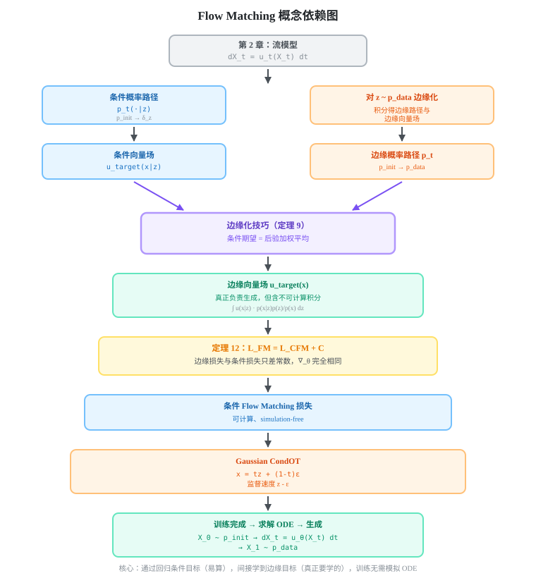

+++
title = 'MIT 6.S184: Flow Matching and Diffusion Models — 第 3 章：流匹配'
date = 2026-09-02
draft = false
summary = 'Flow Matching 通过回归可解析的条件向量场，间接学到边缘向量场，实现 simulation-free 训练。涵盖条件概率路径、边缘化技巧、连续性方程与 Gaussian CondOT 的完整推导。'
tags = ['Flow Matching', 'Diffusion Models', '生成模型', 'ODE']
showReadingTime = true
showTableOfContents = true
+++



> **[MIT 6.S184: Flow Matching and Diffusion Models](https://diffusion.csail.mit.edu/)** 课程笔记

## 一、本章一句话总结

Flow Matching 通过回归一个可解析采样的条件向量场，间接学到能把初始噪声分布连续输运为数据分布的边缘向量场，而且训练时不需要模拟 ODE。

---

## 二、学习目标
完成本章学习后，你应当能够：
- 解释条件概率路径 $p_t(\cdot\mid z)$ 与边缘概率路径 $p_t$ 分别描述什么，以及二者的端点条件
- 区分“分布的轨迹”“单个粒子的轨迹”和“产生轨迹的向量场”三个不同对象
- 说明连续性方程如何表达概率质量守恒，以及式中负号的含义
- 理解 simulation-free 指的是训练阶段，而不是生成阶段
- 从高斯路径 $X_t=\alpha_tz+\beta_t\epsilon$ 推导条件目标向量场
- 用后验加权（边缘化技巧）写出边缘向量场，并解释它为何等于条件期望
- 证明 $L_{\mathrm{FM}}(\theta)=L_{\mathrm{CFM}}(\theta)+C$，其中 $C$ 与 $\theta$ 无关
- 由 Gaussian CondOT 调度 $\alpha_t=t,\ \beta_t=1-t$ 推出监督速度 $z-\epsilon$
- 区分条件向量场与边缘向量场各自的作用与终点
- 区分概率路径（分布如何变化）与向量场（粒子如何运动）
- 对比本章的确定性 ODE 视角与第 4 章 Score-Based Models 的 SDE 视角
- 写出 Gaussian CondOT 的完整训练循环（采样 $z,t,\epsilon$ → 构造 $x$ → 回归 $z-\epsilon$）
- 用 Euler、Heun 等 ODE solver 从 $p_{\mathrm{init}}$ 积分到 $t=1$ 生成样本
- 判断给定的 noise scheduler $(\alpha_t,\beta_t)$ 是否满足端点条件与单调性要求

---

## 三、章节主线
### 核心问题驱动链
| 要解决的问题 | 本章的方法 | 得到的结论 |
| --- | --- | --- |
| ODE 在中间时刻应该产生什么分布？ | 指定条件概率路径 $p_t(x\mid z)$，再对数据点 $z$ 边缘化 | 得到连接 $p_{\mathrm{init}}$ 与 $p_{\mathrm{data}}$ 的边缘概率路径 $p_t(x)$ |
| 什么速度场能实现这条分布路径？ | 先为每个数据点构造条件向量场 $u_t^{\mathrm{target}}(x\mid z)$ | 通过边缘化技巧得到真正负责生成的边缘向量场 $u_t^{\mathrm{target}}(x)$ |
| 边缘向量场包含不可计算的积分，怎么训练？ | 用条件向量场作为逐样本回归目标 | 条件损失与边缘损失只差与参数无关的常数，梯度完全相同 |
| 训练后如何生成？ | 从 $p_{\mathrm{init}}$ 采样并求解学习到的 ODE | 理想情况下终点满足 $X_1\sim p_{\mathrm{data}}$ |
### 概念依赖图


---

## 四、核心概念详解
### 3.0 问题设定：如何训练流模型
第 2 章已经定义了由神经网络向量场 $u_t^\theta:\mathbb R^d\to\mathbb R^d$ 参数化的流模型：

$$
X_0\sim p_{\mathrm{init}},
\qquad
dX_t=u_t^\theta(X_t)\,dt.
$$

其中：
- $t\in[0,1]$ 是连续时间；
- $X_t\in\mathbb R^d$ 是时刻 $t$ 的随机状态；
- $p_{\mathrm{init}}$ 是容易采样的初始分布；
- $p_{\mathrm{data}}$ 是希望模型学习的数据分布；
- $u_t^\theta(x)$ 是神经网络在时刻 $t$、位置 $x$ 给出的速度。
目标是选择参数 $\theta$，使 ODE 的终点满足：

$$
X_1\sim p_{\mathrm{data}}.
$$

困难在于：我们只有数据样本，既不知道应该直接回归哪个向量场，也不想在每次训练更新时都完整模拟一条 ODE 轨迹。Flow Matching 的核心贡献，就是构造一个可以像监督学习一样训练的速度回归目标。

---

### 3.1 条件概率路径与边缘概率路径
#### 3.1.1 条件概率路径：从噪声分布走向一个数据点
固定一个数据点 $z\in\mathbb R^d$。条件概率路径（conditional probability path）是随时间变化的一族分布：

$$
t\longmapsto p_t(\cdot\mid z),
$$

并满足端点条件：

$$
p_0(\cdot\mid z)=p_{\mathrm{init}},
\qquad
p_1(\cdot\mid z)=\delta_z.
$$
$\delta_z$ 是位于 $z$ 的 Dirac delta 分布：从中采样永远得到 $z$。因此，固定 $z$ 后，条件路径描述的是一个完整初始分布如何逐渐收缩并移动到这个数据点。
概率路径只指定每个时刻的分布，通常不唯一决定粒子的运动方式。负责指定粒子速度的是后面定义的向量场。
#### 3.1.2 边缘概率路径：从噪声分布走向整个数据分布
对随机数据点 $Z\sim p_{\mathrm{data}}$，先采样 $Z$，再从其条件路径采样：

$$
Z\sim p_{\mathrm{data}},
\qquad
X_t\sim p_t(\cdot\mid Z).
$$

忽略具体采到了哪个 $Z$ 后，$X_t$ 的分布称为边缘概率路径（marginal probability path）：

$$
p_t(x)=\int p_t(x\mid z)p_{\mathrm{data}}(z)\,dz.
$$

它的端点为：

$$
p_0=p_{\mathrm{init}},
\qquad
p_1=p_{\mathrm{data}}.
$$

验证终点很直接：

$$
p_1(x)=
\int \delta_z(x)p_{\mathrm{data}}(z)\,dz=
p_{\mathrm{data}}(x).
$$

这里有一个贯穿全章的“可采样但不可求密度”现象：
- 从 $p_t$ 采样很容易：采样 $z$，再采样 $x\sim p_t(\cdot\mid z)$；
- 直接计算 $p_t(x)$ 往往很难，因为需要对所有可能的数据点 $z$ 积分。
#### 3.1.3 最重要的例子：高斯条件概率路径
令 $\alpha_t,\beta_t$ 是连续可微的 noise scheduler，其中 $\alpha_t$ 单调递增、$\beta_t$ 单调递减，并满足端点条件：

$$
\alpha_0=0,\quad \alpha_1=1,
\qquad
\beta_0=1,\quad \beta_1=0.
$$

定义：

$$
p_t(\cdot\mid z)=
\mathcal N(\alpha_tz,\beta_t^2I_d).
$$

若 $\epsilon\sim\mathcal N(0,I_d)$，则可以用重参数化方式采样：

$$
X_t=\alpha_tz+\beta_t\epsilon
\sim
p_t(\cdot\mid z).
$$

在 $t=0$ 时 $X_0=\epsilon$，在 $t=1$ 时 $X_1=z$。因此 $\alpha_t$ 控制数据成分，$\beta_t$ 控制噪声成分，端点条件正好给出 $p_0(\cdot\mid z)=\mathcal N(0,I_d)=p_{\mathrm{init}}$ 与 $p_1(\cdot\mid z)=\delta_z$。
教材重点使用高斯路径，是因为它容易采样，而且条件分布、flow map 和目标速度都能解析写出。概率路径的抽象定义本身并不要求初始分布一定是高斯；高斯只是本章最重要、最方便的具体实例。

---

### 3.2 条件向量场与边缘向量场
#### 3.2.1 从“希望的分布”到“实现它的速度场”
概率路径只表达希望 $X_t$ 服从什么分布。为了让粒子真正沿这条分布路径演化，需要找到一个向量场。
对每个固定数据点 $z$，条件目标向量场 $u_t^{\mathrm{target}}(x\mid z)$ 满足：

$$
X_0\sim p_{\mathrm{init}},
\qquad
\frac{dX_t}{dt}=
u_t^{\mathrm{target}}(X_t\mid z)
\quad\Longrightarrow\quad
X_t\sim p_t(\cdot\mid z).
$$

这个条件 ODE 的终点是 $X_1=z$，所以它本身只会重新生成一个已知数据点。它的作用不是直接生成新数据，而是作为构造边缘向量场和训练目标的中间对象。
#### 3.2.2 边缘化技巧：把条件速度合成为生成速度
教材定理 9 定义边缘目标向量场：

$$
u_t^{\mathrm{target}}(x)=
\int
u_t^{\mathrm{target}}(x\mid z)
\frac{p_t(x\mid z)p_{\mathrm{data}}(z)}{p_t(x)}
\,dz.
$$

根据 Bayes 法则，权重

$$
\frac{p_t(x\mid z)p_{\mathrm{data}}(z)}{p_t(x)}
$$

正是“观察到时刻 $t$ 的带噪位置 $x$ 后，它来自数据点 $z$ 的后验权重”。因此也可以写成条件期望：

$$
u_t^{\mathrm{target}}(x)=
\mathbb E\!\left[
u_t^{\mathrm{target}}(x\mid Z)
\;\middle|\;
X_t=x
\right].
$$

定理 9 的结论是：这个边缘向量场会产生边缘概率路径：

$$
X_0\sim p_{\mathrm{init}},
\qquad
\frac{dX_t}{dt}=u_t^{\mathrm{target}}(X_t)
\quad\Longrightarrow\quad
X_t\sim p_t.
$$

特别地：

$$
X_1\sim p_1=p_{\mathrm{data}}.
$$

#### 3.2.3 高斯概率路径的条件目标向量场
对高斯路径

$$
X_t=\alpha_tz+\beta_t\epsilon,
\qquad
\epsilon\sim\mathcal N(0,I_d),
$$

固定初始噪声 $\epsilon$，直接对时间求导：

$$
\frac{dX_t}{dt}=
\dot\alpha_tz+\dot\beta_t\epsilon,
$$

其中 $\dot\alpha_t=\partial_t\alpha_t$，$\dot\beta_t=\partial_t\beta_t$。
为了把速度写成当前位置 $x$ 和数据点 $z$ 的函数，由

$$
x=\alpha_tz+\beta_t\epsilon
$$

解出：

$$
\epsilon=\frac{x-\alpha_tz}{\beta_t}.
$$

代回速度公式：

$$
\begin{aligned}
u_t^{\mathrm{target}}(x\mid z)
&=
\dot\alpha_tz
+
\dot\beta_t\frac{x-\alpha_tz}{\beta_t}\\
&=
\left(
\dot\alpha_t-\frac{\dot\beta_t}{\beta_t}\alpha_t
\right)z
+
\frac{\dot\beta_t}{\beta_t}x.
\end{aligned}
$$

这就是教材公式 (20)。训练时使用重参数化样本 $x=\alpha_tz+\beta_t\epsilon$，目标速度可以直接使用更简单的形式：

$$
u_t^{\mathrm{target}}(X_t\mid z)=
\dot\alpha_tz+\dot\beta_t\epsilon.
$$

#### 3.2.4 连续性方程：概率质量守恒
若 ODE 向量场 $u_t$ 使随机变量 $X_t$ 的密度为 $p_t$，则二者满足连续性方程：

$$
\partial_t p_t(x)=
-\operatorname{div}\!\left(p_tu_t\right)(x).
$$

散度定义为：

$$
\operatorname{div}(v_t)(x)=
\sum_{i=1}^{d}
\frac{\partial v_t^i(x)}{\partial x_i}.
$$

其中 $v_t^i$ 是向量场的第 $i$ 个坐标分量。$p_t(x)u_t(x)$ 是概率通量：密度乘以速度。散度为正表示一个微小区域存在净流出，所以区域内密度下降；这解释了连续性方程前面的负号。
定理 9 的证明思路如下；逐步推导见[附录 A：定理 9（边缘化技巧）的完整证明](#theorem-9-proof)：
1. 每条条件概率路径与其条件向量场满足条件连续性方程；
2. 对数据点 $z$ 按 $p_{\mathrm{data}}(z)$ 积分；
3. 利用积分、时间导数和散度的线性性交换运算顺序；
4. 得到边缘密度 $p_t$ 与边缘向量场 $u_t^{\mathrm{target}}$ 的连续性方程。
因此，边缘化后的向量场确实会搬运出我们指定的边缘概率路径，而不只是一个形式上的加权平均。

---

### 3.3 学习边缘向量场
#### 3.3.1 理想但不可计算的边缘 Flow Matching 损失
希望神经网络直接拟合边缘目标向量场：

$$
L_{\mathrm{FM}}(\theta)=
\mathbb E_{\substack{t\sim\mathrm{Unif}[0,1]\\x\sim p_t}}
\left[
\left\|u_t^\theta(x)-u_t^{\mathrm{target}}(x)\right\|^2
\right].
$$

如果能够最小化这个损失，理想情况下便有

$$
u_t^\theta(x)=u_t^{\mathrm{target}}(x),
$$

从而学习到正确的边缘概率路径。但 $u_t^{\mathrm{target}}(x)$ 需要对所有数据点做后验加权积分，通常无法高效计算。
#### 3.3.2 可计算的条件 Flow Matching 损失
改为使用可解析的条件向量场作为监督目标：

$$
L_{\mathrm{CFM}}(\theta)=
\mathbb E_{\substack{
t\sim\mathrm{Unif}[0,1]\\
z\sim p_{\mathrm{data}}\\
x\sim p_t(\cdot\mid z)
}}
\left[
\left\|
u_t^\theta(x)-u_t^{\mathrm{target}}(x\mid z)
\right\|^2
\right].
$$

一次训练样本只需要：
1. 从数据集中采样 $z$；
2. 采样时间 $t$；
3. 从条件路径采样 $x$；
4. 计算解析的条件目标速度；
5. 对网络输出和目标速度做均方误差回归。
#### 3.3.3 为什么回归条件速度能学到边缘速度
教材定理 12 给出（完整推导见[附录 B：定理 12（Flow Matching 损失等价性）的完整证明](#theorem-12-proof)）：

$$
L_{\mathrm{FM}}(\theta)=
L_{\mathrm{CFM}}(\theta)+C,
$$

其中 $C$ 与模型参数 $\theta$ 无关，因此：

$$
\nabla_\theta L_{\mathrm{FM}}(\theta)=
\nabla_\theta L_{\mathrm{CFM}}(\theta).
$$

证明的关键不是死记完整的均方误差展开，而是认出下面的交叉项恒等式：

$$
\mathbb E_{t,x}
\left[
u_t^\theta(x)^\top u_t^{\mathrm{target}}(x)
\right]=
\mathbb E_{t,z,x}
\left[
u_t^\theta(x)^\top u_t^{\mathrm{target}}(x\mid z)
\right].
$$

它成立是因为边缘向量场就是给定 $X_t=x$ 后条件向量场的条件期望。展开两个平方损失后：
- 网络输出的平方项相同；
- 网络输出与目标速度的交叉项相同；
- 剩余的目标速度平方项不依赖 $\theta$，只构成常数差。
所以，虽然单个训练样本的条件目标速度可能指向某个特定数据点，许多样本的均方误差最优预测会自动变成条件平均，也就是所需的边缘向量场。
#### 3.3.4 Gaussian CondOT 的训练公式
对一般高斯路径：

$$
X_t=\alpha_tz+\beta_t\epsilon,
\qquad
\epsilon\sim\mathcal N(0,I_d),
$$

条件 Flow Matching 损失化为：

$$
L_{\mathrm{CFM}}(\theta)=
\mathbb E_{t,z,\epsilon}
\left[
\left\|
u_t^\theta(\alpha_tz+\beta_t\epsilon)
-(\dot\alpha_tz+\dot\beta_t\epsilon)
\right\|^2
\right].
$$

最常用的 Gaussian CondOT 路径取：

$$
\alpha_t=t,
\qquad
\beta_t=1-t.
$$

于是：

$$
X_t=tz+(1-t)\epsilon,
$$

并且（因为 $\dot\alpha_t=1$、$\dot\beta_t=-1$）：

$$
u_t^{\mathrm{target}}(X_t\mid z)=
z-\epsilon.
$$

最终训练损失为：

$$
\boxed{
L_{\mathrm{CFM}}(\theta)=
\mathbb E_{t,z,\epsilon}
\left[
\left\|
u_t^\theta\!\left(tz+(1-t)\epsilon\right)
-(z-\epsilon)
\right\|^2
\right]
}
$$

对应教材算法 3：
```plain text
重复执行：
1. 采样数据 z ~ p_data
2. 采样时间 t ~ Unif[0,1]
3. 采样噪声 ε ~ N(0, I_d)
4. 构造带噪样本 x = tz + (1-t)ε
5. 计算目标速度 v = z - ε
6. 最小化 ||u_θ(x, t) - v||² 并更新 θ
```
写成训练循环的形式：
```python
# 训练一个 epoch（Gaussian CondOT）
for batch in dataloader:
    z = batch                           # 真实数据 z ~ p_data
    t = uniform(0, 1, size=batch_size)  # 时间 t ~ Unif[0,1]
    eps = randn_like(z)                 # 噪声 ε ~ N(0, I)

    x = t * z + (1 - t) * eps           # 带噪样本，无需模拟 ODE
    v_target = z - eps                  # 解析目标速度

    v_pred = u_theta(x, t)
    loss = mean((v_pred - v_target) ** 2)

    optimizer.zero_grad()
    loss.backward()
    optimizer.step()
```
#### 3.3.5 训练与生成是两个不同阶段
Flow Matching 训练具有 simulation-free 特性：训练时直接构造任意时刻的 $(t,x)$ 和目标速度，不需要从 $t=0$ 开始逐步求解 ODE。
训练完成后，生成阶段才需要模拟 ODE：

$$
X_0\sim p_{\mathrm{init}},
\qquad
dX_t=u_t^\theta(X_t)\,dt.
$$

使用 Euler、Heun 或其他 ODE solver 从 $t=0$ 积分到 $t=1$，得到生成样本 $X_1$：
```python
# 采样（Euler 法，N 步）
x = randn(shape)      # X_0 ~ p_init = N(0, I)
dt = 1.0 / N
for i in range(N):
    t = i * dt
    x = x + u_theta(x, t) * dt
return x              # X_1 ≈ p_data 的样本
```
| 阶段 | 是否需要真实数据 $z$ | 是否采样条件噪声 | 是否求解 ODE | 输出 |
| --- | --- | --- | --- | --- |
| **训练** | 是 | 是 | 否 | 学到向量场参数 $\theta$ |
| **生成** | 否 | 只采样初始状态 $X_0$ | 是 | 生成样本 $X_1$ |

---

## 五、与相邻章节的对比
### 5.1 与第 2 章的关系
第 2 章只定义了流模型“长什么样”（ODE 与向量场），没有说明如何训练。本章补上的正是**训练目标的构造**：
- 第 2 章：给定 $u_t$，如何演化并采样；
- 第 3 章：给定数据，如何确定应该回归哪个 $u_t$。
### 5.2 与第 4 章 Score-Based Models 的对比
| 维度 | Flow Matching（第 3 章） | Score-Based Models（第 4 章） |
| --- | --- | --- |
| **生成过程** | 确定性 ODE | 随机 SDE（或对应的 Probability Flow ODE） |
| **学习目标** | 向量场 $u_t^\theta(x)$ | Score function $\nabla_x\log p_t(x)$ |
| **监督信号** | 条件向量场 $u_t^{\mathrm{target}}(x\mid z)$ | 条件 score $\nabla_x\log p_t(x\mid z)$ |
| **训练方式** | 条件流匹配 CFM | 去噪评分匹配 DSM |
| **核心定理** | 边缘化技巧 + 连续性方程（定理 9、12） | Anderson 时间反演定理 |
| **随机性来源** | 仅初始点 $X_0$ | 初始点 + 每一步布朗噪声 |
**共同的证明骨架**：两章都使用同一个论证——“边缘量 = 条件量的后验期望”，因此“回归条件目标”与“回归边缘目标”只差一个与参数无关的常数。理解本章的定理 12，第 4 章的 DSM 推导几乎可以直接复用。
### 5.3 两者之间的桥梁（延伸）
对高斯路径 $p_t(\cdot\mid z)=\mathcal N(\alpha_tz,\beta_t^2I_d)$，边缘向量场与边缘 score 可以互相换算：

$$
u_t^{\mathrm{target}}(x)=
\frac{\dot\alpha_t}{\alpha_t}x
+
\left(
\frac{\dot\alpha_t\beta_t^2}{\alpha_t}-\dot\beta_t\beta_t
\right)
\nabla_x\log p_t(x).
$$

这说明在同一族高斯路径下，学向量场和学 score 携带的是等价信息；第 4 章会从 SDE 角度重新导出这一关系。

---

## 六、自测与检查清单
### 自测题
<details>
<summary><b>Q1：条件概率路径和边缘概率路径分别连接什么？</b></summary>

**答案**：

固定数据点 $z$ 后，条件概率路径连接 $p_{\mathrm{init}}$ 与 $\delta_z$；对 $z\sim p_{\mathrm{data}}$ 边缘化后，边缘概率路径连接 $p_{\mathrm{init}}$ 与完整的 $p_{\mathrm{data}}$。

**相关章节**：3.1.1、3.1.2 节

</details>

<details>
<summary><b>Q2：为什么说概率路径是“分布的轨迹”，而不是粒子的轨迹？</b></summary>

**答案**：

概率路径 $t\mapsto p_t$ 只规定每个时刻所有粒子的总体分布；单个粒子的轨迹是 $t\mapsto X_t$。大量粒子沿向量场运动后在每个时刻形成的总体分布，才构成概率路径。同一条概率路径通常可以由不止一个向量场实现。

**相关章节**：3.1.1 节

</details>

<details>
<summary><b>Q3：边缘向量场为什么是条件向量场的后验加权平均？</b></summary>

**答案**：

观察到带噪点 $X_t=x$ 后，我们不知道它对应哪个干净数据点 $z$。每个 $z$ 给出一个条件速度，而 $p_t(x\mid z)p_{\mathrm{data}}(z)/p_t(x)$ 表示该 $z$ 的后验可信度；按此权重平均便得到只依赖 $(x,t)$ 的边缘速度。

**相关章节**：3.2.2 节

</details>

<details>
<summary><b>Q4：从 $X_t=\alpha_tz+\beta_t\epsilon$ 推导条件目标速度。</b></summary>

**答案**：

固定 $z$ 和初始噪声 $\epsilon$，对时间求导：

$$
\frac{dX_t}{dt}=\dot\alpha_tz+\dot\beta_t\epsilon.
$$

若需要写成 $x,z$ 的函数，再代入 $\epsilon=(x-\alpha_tz)/\beta_t$，得到

$$
u_t^{\mathrm{target}}(x\mid z)=
\left(\dot\alpha_t-\frac{\dot\beta_t}{\beta_t}\alpha_t\right)z
+
\frac{\dot\beta_t}{\beta_t}x.
$$

**相关章节**：3.2.3 节

</details>

<details>
<summary><b>Q5：连续性方程中的负号表示什么？</b></summary>

**答案**：

$\operatorname{div}(p_tu_t)>0$ 表示某个微小区域存在概率质量净流出，因此该位置的概率密度随时间下降，即 $\partial_tp_t<0$，所以二者之间有负号。注意散度作用在概率通量 $p_tu_t$ 上，而不是单独作用在 $u_t$ 上。

**相关章节**：3.2.4 节

</details>

<details>
<summary><b>Q6：为什么可以用 $L_{\mathrm{CFM}}$ 替代不可计算的 $L_{\mathrm{FM}}$？</b></summary>

**答案**：

两者展开后，依赖网络参数的平方项和交叉项相同，差异只来自目标向量场自身的平方项，而该项不依赖 $\theta$。因此两个损失只差常数，关于 $\theta$ 的梯度相同。交叉项相等的原因是：边缘向量场恰好是给定 $X_t=x$ 后条件向量场的条件期望。

**相关章节**：3.3.1–3.3.3 节

</details>

<details>
<summary><b>Q7：写出 Gaussian CondOT 的带噪样本和监督速度。</b></summary>

**答案**：

$$
x=tz+(1-t)\epsilon,
\qquad
\epsilon\sim\mathcal N(0,I_d),
$$

监督速度为：

$$
z-\epsilon.
$$

它来自 $\alpha_t=t,\ \beta_t=1-t$，于是 $\dot\alpha_t=1,\ \dot\beta_t=-1$。

**相关章节**：3.3.4 节

</details>

<details>
<summary><b>Q8：Flow Matching 的 simulation-free 指什么？生成时也不需要 ODE solver 吗？</b></summary>

**答案**：

simulation-free 只指训练时可以直接采样任意 $(t,x)$ 并回归目标速度，不需要展开 ODE 轨迹。生成时仍需从 $p_{\mathrm{init}}$ 采样 $X_0$，再用 ODE solver 积分到 $t=1$。

**相关章节**：3.3.5 节

</details>

### 检查清单
完成本章学习后，确认你能够：
- [ ] 解释 $p_t(\cdot\mid z)$ 与 $p_t$ 的区别及端点条件
- [ ] 区分分布轨迹、粒子轨迹和向量场
- [ ] 用“后验加权平均”解释边缘化技巧
- [ ] 解释连续性方程如何表达概率质量守恒
**数学推导**
- [ ] 从高斯路径推导 $\dot\alpha_tz+\dot\beta_t\epsilon$
- [ ] 把条件速度改写成 $(x,z)$ 的函数（教材公式 20）
- [ ] 说明 $L_{\mathrm{FM}}$ 为什么不可直接计算
- [ ] 说明 $L_{\mathrm{CFM}}$ 为什么仍能学到边缘向量场
**算法实现**
- [ ] 写出 CondOT 的 $x=tz+(1-t)\epsilon$ 和目标速度 $z-\epsilon$
- [ ] 实现教材算法 3 的训练循环
- [ ] 用 Euler 法实现从 $t=0$ 到 $t=1$ 的采样
**对比分析**
- [ ] 区分 Flow Matching 的训练阶段与 ODE 生成阶段
- [ ] 对比条件向量场与边缘向量场的作用
- [ ] 说明本章与第 4 章 Score-Based Models 在目标和随机性上的差异

---

## 七、重点公式速查
### 条件概率路径的端点

$$
p_0(\cdot\mid z)=p_{\mathrm{init}},
\qquad
p_1(\cdot\mid z)=\delta_z.
$$

### 边缘概率路径

$$
p_t(x)=\int p_t(x\mid z)p_{\mathrm{data}}(z)\,dz,
\qquad
p_0=p_{\mathrm{init}},\quad p_1=p_{\mathrm{data}}.
$$

### 高斯条件路径的采样

$$
X_t=\alpha_tz+\beta_t\epsilon,
\qquad
\epsilon\sim\mathcal N(0,I_d).
$$

### 边缘化技巧

$$
u_t^{\mathrm{target}}(x)=
\mathbb E\!\left[
u_t^{\mathrm{target}}(x\mid Z)
\;\middle|\;
X_t=x
\right].
$$

### 高斯路径的条件目标速度

$$
u_t^{\mathrm{target}}(X_t\mid z)=
\dot\alpha_tz+\dot\beta_t\epsilon.
$$

### 连续性方程

$$
\partial_t p_t(x)=
-\operatorname{div}(p_tu_t)(x).
$$

### 条件 Flow Matching 损失

$$
L_{\mathrm{CFM}}(\theta)=
\mathbb E_{t,z,x}
\left[
\left\|u_t^\theta(x)-u_t^{\mathrm{target}}(x\mid z)\right\|^2
\right].
$$

### Gaussian CondOT 训练目标

$$
x=tz+(1-t)\epsilon,
\qquad
u_t^{\mathrm{target}}=z-\epsilon.
$$

---
## 八、与课程其他章节的连接
**输入依赖**（需要先掌握的章节）：
- 第 1 章：生成建模即采样，明确目标是学习并采样 $p_{\mathrm{data}}$
- 第 2 章：ODE / SDE、流模型与向量场的定义，以及数值模拟方法
**输出支持**（本章为后续章节奠定基础）：
- 第 4 章：Score-Based Diffusion Models 把同一套“条件目标 → 边缘目标”的论证搬到 score 与 SDE 上
- 第 5 章：Guidance 在已有向量场 / score 的基础上加入条件控制
- 第 6 章：DiT、VAE 与潜空间，把本章的训练目标放进大规模架构中
**横向对比**：
- 第 4 章：随机 SDE 视角与本章确定性 ODE 视角互为补充，在 Probability Flow ODE 处汇合

---

## 九、进一步学习资源
**原始论文**
1. **Flow Matching for Generative Modeling**（Lipman et al., ICLR 2023）
	- 提出 Flow Matching 与 Conditional Flow Matching 框架
	- 引入本章使用的 CondOT（最优传输式）条件路径
2. **Flow Straight and Fast: Learning to Generate and Transfer Data with Rectified Flow**（Liu et al., ICLR 2023）
	- 与 CondOT 等价的“直线插值”视角
	- Reflow 迭代拉直轨迹，支持极少步采样
3. **Building Normalizing Flows with Stochastic Interpolants**（Albergo & Vanden-Eijnden, ICLR 2023）
	- 随机插值视角，把 ODE 与 SDE 统一在同一族路径下
4. **Neural Ordinary Differential Equations**（Chen et al., NeurIPS 2018）
	- 连续归一化流的起点，理解 ODE 生成模型的背景
**推荐阅读顺序**
1. 先读本章笔记 + 课程讲义第 3 章（建立整体框架）
2. 精读 Flow Matching 论文（理解条件路径的一般构造）
3. 对照 Rectified Flow（理解直线路径与少步采样）
4. 再进入第 4 章，把 ODE 视角扩展到 SDE 与 score
**代码实现**
- [facebookresearch/flow_matching](https://github.com/facebookresearch/flow_matching)：Meta 官方 Flow Matching 库
- [conditional-flow-matching (torchcfm)](https://github.com/atong01/conditional-flow-matching)：条件流匹配的教学与研究实现
- [MIT 6.S184 课程网站](https://diffusion.csail.mit.edu/)：配套 lab notebook

---

## 十、常见误解澄清
**误解 1：条件概率路径就是单个样本的轨迹**

- **纠正**：$p_t(\cdot\mid z)$ 是每个时刻的**分布**；$t\mapsto X_t$ 才是单粒子轨迹。

**误解 2：条件路径和边缘路径的终点相同**

- **纠正**：固定 $z$ 的条件路径终止于 $\delta_z$；混合所有 $z$ 的边缘路径才终止于 $p_{\mathrm{data}}$。

**误解 3：条件向量场直接负责生成新样本**

- **纠正**：它只把样本送向指定数据点；真正把噪声分布送往数据分布的是边缘向量场。

**误解 4：边缘化就是简单的等权平均**

- **纠正**：权重是给定当前带噪点 $x$ 后关于数据点 $z$ 的**后验分布**，不是均匀权重。

**误解 5：概率路径等于向量场**

- **纠正**：概率路径规定分布如何变化；向量场规定粒子如何运动。同一条分布路径可能对应不止一个向量场。

**误解 6：网络直接接收数据点 $z$**

- **纠正**：无条件 Flow Matching 的网络输入是 $(x,t)$；$z$ 只在训练时用于构造带噪输入和监督速度。

**误解 7：训练目标是条件速度，所以学到的也只是条件速度**

- **纠正**：均方误差的最优预测是条件期望，配合定理 12，学到的正是边缘速度。

**误解 8：simulation-free 意味着生成时也不用 ODE solver**

- **纠正**：simulation-free 只描述训练阶段；生成阶段仍必须数值积分 ODE。

**误解 9：连续性方程是 $\partial_tp_t=-\operatorname{div}(u_t)$**

- **纠正**：散度作用在概率通量 $p_tu_t$ 上，正确形式是 $\partial_tp_t=-\operatorname{div}(p_tu_t)$。

**误解 10：中文译名混用不影响理解**

- **纠正**：教材术语 “marginal” 可能被译作“边缘”或“边际”，本笔记统一使用**边缘**，阅读其他资料时需留意。

---

## 十一、本章在实际应用中的体现
**图像与视频生成**
- **Stable Diffusion 3**：基于 rectified flow 的多模态扩散 Transformer
- **FLUX.1**：以 flow matching 目标训练的大规模图像生成模型
- **Movie Gen**（Meta）：视频生成同样采用 flow matching 训练目标
**语音与音频**
- **Voicebox / Audiobox**（Meta）：以 flow matching 训练的语音与音频生成模型
**科学与结构生成**
- 蛋白质骨架、分子构象生成中的 SE(3) flow matching 方法（如 FoldFlow、FrameFlow）
**少步采样**
- CondOT / Rectified Flow 的轨迹近似为直线，少步 Euler 采样即可得到可用样本
- Reflow 与蒸馏方法可进一步把采样压缩到 1–4 步

---

## 附录 A：定理 9（边缘化技巧）的完整证明 {#theorem-9-proof}

### A.1 命题与假设

对每个数据点 $z$，设条件概率路径 $p_t(x\mid z)$ 由条件向量场 $u_t^{\mathrm{target}}(x\mid z)$ 生成。也就是说，它们满足条件连续性方程

$$
\partial_t p_t(x\mid z)
+
\operatorname{div}_x\!\left(
p_t(x\mid z)u_t^{\mathrm{target}}(x\mid z)
\right)=0.
$$

定义边缘概率路径

$$
p_t(x)=\int p_t(x\mid z)p_{\mathrm{data}}(z)\,dz,
$$

以及边缘目标向量场

$$
u_t^{\mathrm{target}}(x)=
\int
u_t^{\mathrm{target}}(x\mid z)
\frac{p_t(x\mid z)p_{\mathrm{data}}(z)}{p_t(x)}
\,dz.
$$

需要证明：$p_t$ 与 $u_t^{\mathrm{target}}$ 满足边缘连续性方程

$$
\partial_t p_t(x)
+
\operatorname{div}_x\!\left(
p_t(x)u_t^{\mathrm{target}}(x)
\right)=0,
$$

因此边缘向量场确实生成边缘概率路径 $p_t$。

下面假设各密度和向量场足够光滑、相关积分有限，使时间微分、空间散度与关于 $z$ 的积分可以交换。向量场中的比值只需在 $p_t(x)>0$ 的区域定义；在零密度区域如何取值不会改变概率通量。

### A.2 对条件连续性方程做边缘化

从边缘密度的定义出发，对时间求导：

$$
\begin{aligned}
\partial_t p_t(x)
&=\partial_t\int p_t(x\mid z)p_{\mathrm{data}}(z)\,dz\\
&=\int \partial_t p_t(x\mid z)p_{\mathrm{data}}(z)\,dz.
\end{aligned}
$$

代入每条条件路径满足的连续性方程：

$$
\begin{aligned}
\partial_t p_t(x)
&=-\int
\operatorname{div}_x\!\left(
p_t(x\mid z)u_t^{\mathrm{target}}(x\mid z)
\right)
p_{\mathrm{data}}(z)\,dz\\
&=-\operatorname{div}_x\!\left[
\int
p_t(x\mid z)u_t^{\mathrm{target}}(x\mid z)
p_{\mathrm{data}}(z)\,dz
\right].
\end{aligned}
$$

第二个等号利用了散度的线性性，并将关于 $x$ 的散度移到关于 $z$ 的积分之外。方括号中的量是所有条件概率通量的加权和。

### A.3 识别边缘概率通量

将边缘向量场的定义乘以 $p_t(x)$：

$$
\begin{aligned}
p_t(x)u_t^{\mathrm{target}}(x)
&=p_t(x)
\int
u_t^{\mathrm{target}}(x\mid z)
\frac{p_t(x\mid z)p_{\mathrm{data}}(z)}{p_t(x)}
\,dz\\
&=\int
p_t(x\mid z)u_t^{\mathrm{target}}(x\mid z)
p_{\mathrm{data}}(z)\,dz.
\end{aligned}
$$

因此，边缘概率通量 $p_tu_t^{\mathrm{target}}$ 恰好等于条件概率通量的边缘化结果。把这个恒等式代回上一节可得

$$
\partial_t p_t(x)=
-\operatorname{div}_x\!\left(
p_t(x)u_t^{\mathrm{target}}(x)
\right),
$$

这正是边缘连续性方程。因而在通常的正则性条件下，从 $p_0$ 出发沿边缘向量场求解 ODE，时刻 $t$ 的密度就是 $p_t$。

### A.4 验证概率路径的两个端点

条件路径的起点与 $z$ 无关，即 $p_0(x\mid z)=p_{\mathrm{init}}(x)$。所以

$$
\begin{aligned}
p_0(x)
&=\int p_0(x\mid z)p_{\mathrm{data}}(z)\,dz\\
&=p_{\mathrm{init}}(x)
\int p_{\mathrm{data}}(z)\,dz\\
&=p_{\mathrm{init}}(x).
\end{aligned}
$$

条件路径的终点为 $p_1(x\mid z)=\delta_z(x)$，因此

$$
\begin{aligned}
p_1(x)
&=\int \delta_z(x)p_{\mathrm{data}}(z)\,dz\\
&=p_{\mathrm{data}}(x).
\end{aligned}
$$

至此得到

$$
p_0=p_{\mathrm{init}},
\qquad
p_1=p_{\mathrm{data}},
$$

并证明了由边缘向量场生成的概率路径连接初始分布与数据分布。

> **关键点：** 定理并不是直接对粒子轨迹做平均，而是先对条件概率通量 $p_t(x\mid z)u_t^{\mathrm{target}}(x\mid z)$ 做边缘化，再除以当前位置的边缘密度 $p_t(x)$，得到能够保持同一边缘概率路径的速度场。

---

## 附录 B：定理 12（Flow Matching 损失等价性）的完整证明 {#theorem-12-proof}

### B.1 记号与命题

考虑训练时使用的联合采样过程：

$$
t\sim\operatorname{Unif}[0,1],
\qquad
Z\sim p_{\mathrm{data}},
\qquad
X_t\sim p_t(\cdot\mid Z).
$$

为简化记号，定义三个随机向量：

$$
\begin{aligned}
F&=u_t^\theta(X_t),\\
V&=u_t^{\mathrm{target}}(X_t\mid Z),\\
M&=u_t^{\mathrm{target}}(X_t)
=\mathbb E[V\mid t,X_t].
\end{aligned}
$$

其中 $F$ 是网络预测，$V$ 是可解析的条件目标速度，$M$ 是需要学习的边缘目标速度。最后一个等号来自定理 9 的边缘化公式。两个损失可以写为

$$
L_{\mathrm{CFM}}(\theta)=\mathbb E\lVert F-V\rVert^2,
\qquad
L_{\mathrm{FM}}(\theta)=\mathbb E\lVert F-M\rVert^2.
$$

下面假设这些随机向量具有有限二阶矩。需要证明两个损失只相差一个与模型参数 $\theta$ 无关的常数。

### B.2 条件期望带来的正交分解

先将条件目标速度与网络预测之差拆开：

$$
F-V=(F-M)+(M-V).
$$

对平方范数展开：

$$
\lVert F-V\rVert^2
=\lVert F-M\rVert^2
+\lVert M-V\rVert^2
+2(F-M)^\top(M-V).
$$

关键是证明最后的交叉项期望为零。因为 $F-M$ 只依赖于 $(t,X_t)$，所以在给定 $(t,X_t)$ 后它可以移到条件期望之外：

$$
\begin{aligned}
&\mathbb E\!\left[(F-M)^\top(M-V)\right]\\
&=\mathbb E\!\left[
(F-M)^\top
\mathbb E[M-V\mid t,X_t]
\right]\\
&=\mathbb E\!\left[
(F-M)^\top
\left(M-\mathbb E[V\mid t,X_t]\right)
\right]\\
&=0.
\end{aligned}
$$

第三个等号正是使用了 $M=\mathbb E[V\mid t,X_t]$。这说明条件期望 $M$ 是 $V$ 在所有 $(t,X_t)$ 的函数所构成空间上的 $L^2$ 投影，而残差 $V-M$ 与任何这样的预测误差正交。

对平方范数的展开式取期望，交叉项消失，于是得到

$$
L_{\mathrm{CFM}}(\theta)
=L_{\mathrm{FM}}(\theta)
+\mathbb E\lVert V-M\rVert^2.
$$

等价地，

$$
L_{\mathrm{FM}}(\theta)
=L_{\mathrm{CFM}}(\theta)+C,
\qquad
C=-\mathbb E\lVert V-M\rVert^2\le 0.
$$

$V$ 和 $M$ 都由预先选定的概率路径与目标向量场决定，不含模型参数 $\theta$，因此 $C$ 与 $\theta$ 无关。这就证明了定理 12。

### B.3 与教材平方展开法的对应

也可以直接展开两个均方误差：

$$
\begin{aligned}
L_{\mathrm{FM}}(\theta)
&=\mathbb E\lVert F\rVert^2
-2\mathbb E[F^\top M]
+\mathbb E\lVert M\rVert^2,\\
L_{\mathrm{CFM}}(\theta)
&=\mathbb E\lVert F\rVert^2
-2\mathbb E[F^\top V]
+\mathbb E\lVert V\rVert^2.
\end{aligned}
$$

两式中网络输出的平方项完全相同。交叉项也相同，因为全期望公式给出

$$
\begin{aligned}
\mathbb E[F^\top V]
&=\mathbb E\!\left[
\mathbb E[F^\top V\mid t,X_t]
\right]\\
&=\mathbb E\!\left[
F^\top\mathbb E[V\mid t,X_t]
\right]\\
&=\mathbb E[F^\top M].
\end{aligned}
$$

因此两个损失之差只来自目标速度的平方项：

$$
C
=\mathbb E\lVert M\rVert^2
-\mathbb E\lVert V\rVert^2
=-\mathbb E\lVert V-M\rVert^2.
$$

这与上一节的正交分解完全一致。

### B.4 梯度与最优预测

由于 $C$ 不依赖 $\theta$，只要损失关于 $\theta$ 可微，就有

$$
\nabla_\theta L_{\mathrm{FM}}(\theta)
=\nabla_\theta L_{\mathrm{CFM}}(\theta).
$$

因此两个目标具有相同的梯度和极小点。若模型容量足够且优化达到总体均方误差的最优解，则

$$
u_t^{\theta^*}(x)
=\mathbb E\!\left[
u_t^{\mathrm{target}}(x\mid Z)
\mid X_t=x,\,t
\right]
=u_t^{\mathrm{target}}(x).
$$

所以训练时虽然每次回归的是依赖具体数据点 $Z$ 的条件速度，模型在只观察 $(x,t)$ 的情况下，均方误差会迫使它输出这些条件速度的后验平均，也就是生成所需的边缘向量场。条件目标引入的额外项 $\mathbb E\lVert V-M\rVert^2$ 只反映同一 $(t,x)$ 下条件速度的不可约方差，不会改变对 $\theta$ 的优化方向。
