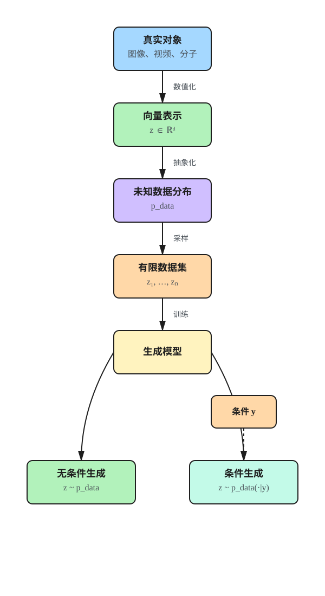

+++
title = 'MIT 6.S184: Flow Matching and Diffusion Models — 第 1 章：生成建模即采样'
date = 2026-09-01
draft = false
summary = '生成建模的核心任务不是寻找唯一的「最佳答案」，而是学习一个未知的数据分布并从中采样：把图像、视频、分子统一表示为向量，用有限数据集逼近 p_data，并区分无条件生成与条件生成。'
tags = ['Diffusion Models', 'Flow Matching', '生成建模']
showReadingTime = true
showTableOfContents = true
+++



> **[MIT 6.S184: Flow Matching and Diffusion Models](https://diffusion.csail.mit.edu/)** 课程笔记（v1.3）

> 🎯 **本章一句话总结：** 生成模型的核心任务不是寻找唯一的「最佳答案」，而是学习一个未知的数据分布 $p_{\mathrm{data}}$，并从中产生新的样本。

## 学习目标

**理解层面**

- 理解生成式 AI 与预测式 AI 的根本区别：输出一个分布上的样本，而不是一个确定的标签或数值。
- 理解「生成即采样」这一表述，以及 $p_{\mathrm{data}}$ 的含义与不可知性。
- 理解无条件生成与条件（引导）生成的关系。

**表示层面**

- 能把图像、视频、分子结构统一表示为向量 $z\in\mathbb{R}^d$，并写出各自的维度。
- 能说明文本为什么是这一框架下的重要例外。

**区分层面**

- 区分真实数据分布 $p_{\mathrm{data}}$、有限数据集 $\{z_1,\ldots,z_N\}$ 与训练后的生成模型。
- 区分概率密度 $p_{\mathrm{data}}(z)$ 与「样本好不好看」这类人为评价。
- 区分「记忆/检索训练数据」与「从分布中生成新样本」。

**应用层面**

- 能把一个具体任务（文生图、蛋白质设计、机器人动作生成）改写成「从某个条件分布采样」的形式。
- 能解释为什么生成模型的评价不能只看单一损失值。

## 章节主线

### 核心问题驱动链

| 问题 | 本章回答 | 对应小节 |
|------|----------|----------|
| 生成任务和预测任务的区别在哪？ | 预测要一个答案，生成要一整族合理答案。 | 1.1 |
| 如何让「图像 / 视频 / 分子」变成可计算对象？ | 数值化并展平为 $z\in\mathbb{R}^d$。 | 关键思想 1 |
| 「一族合理答案」如何精确表述？ | 假设存在未知数据分布 $p_{\mathrm{data}}$，生成 = 采样。 | 关键思想 2 |
| $p_{\mathrm{data}}$ 未知，怎么办？ | 用有限数据集 $z_1,\ldots,z_N$ 作为它的代理。 | 关键思想 3 |
| 如何让生成结果听指令？ | 改为从条件分布 $p_{\mathrm{data}}(\cdot\mid y)$ 采样。 | 关键思想 4 |
| 采样器具体怎么造？ | 本章不回答，交给第 2 章的 ODE / SDE。 | 1.2 |

### 本章逻辑链

## 核心概念详解

### 1.1 课程要解决什么问题

传统机器学习系统主要完成**预测**：输入一个对象，输出标签、数值或判断。生成式 AI 则需要创造新的对象，例如图像、视频、文本或蛋白质结构。

本课程研究两类核心方法：

- **Flow Matching（流匹配）**
- **Denoising Diffusion Models（去噪扩散模型）**

它们共享同一条主线：从一个容易采样的噪声分布出发，通过神经网络控制的 ODE 或 SDE，逐步把噪声输运成符合数据分布的样本。

> 💡 **直觉：** 从数据加噪得到噪声很容易（正向过程几乎不需要学习）；难的是学习如何逆转这一过程，把噪声逐步变成数据。整门课都在解决这个「逆转」问题。

### 1.2 全课程路线图

| 章节 | 核心问题 |
|------|----------|
| 第 1 章 | 如何把「生成」表述成概率采样问题？ |
| 第 2 章 | 如何利用 ODE / SDE 把噪声输运为数据？ |
| 第 3 章 | 如何用 Flow Matching 学习 ODE 的向量场？ |
| 第 4 章 | 如何学习 score function，并使用 SDE 采样？ |
| 第 5 章 | 如何通过 Guidance 让结果服从提示词？ |
| 第 6 章 | 如何用 DiT、VAE 和潜空间构建大规模生成器？ |
| 第 7 章 | 如何把扩散模型推广到文本等离散数据？ |

需要的主要预备知识是概率论；讲义附录 A 提供了简要复习。

**本章在路线图中的位置。** 第 1 章只负责「定义问题」，不涉及任何模型、损失函数或采样算法。第 2 章开始给出采样器的形式，第 3、4 章给出训练目标，第 5 章之后处理条件与工程化。

### 1.3 生成建模即采样

#### 关键思想 1：生成对象可以表示为向量

对连续数据，先把对象数值化：

- **图像**：$z\in\mathbb{R}^{H\times W\times 3}$，三个通道对应 RGB。
- **视频**：$z\in\mathbb{R}^{T\times H\times W\times 3}$，比图像多一个时间（帧）维度。
- **分子结构**：一种简单表示是 $z=(z^1,\ldots,z^N)\in\mathbb{R}^{3\times N}$，其中每个 $z^i\in\mathbb{R}^3$ 是一个原子的三维坐标。

展平后，全部可以统一写成：

$$
z\in\mathbb{R}^d
$$

**两点补充。** 第一，纯坐标表示省略了原子种类、键连接等信息，真实的分子生成模型通常还要额外建模这些离散属性。第二，分子坐标带有平移、旋转等对称性，实际系统会用等变网络处理，这不影响本章「对象即向量」的抽象。

**文本是重要例外。** token 属于有限词表，通常是离散对象。语言模型内部的 embedding 虽然是连续向量，但最终生成的 token 状态空间仍然是离散的，因此不能直接套用连续扩散的做法。需要补充的是，也有工作把扩散过程放在连续的 embedding 空间上（如 Diffusion-LM 一类），所以并非「文本完全无法用连续扩散」；只是主流做法仍是设计离散状态上的转移机制，见第 7 章。

#### 关键思想 2：生成就是从数据分布中采样

假设所有合理对象共同构成一个未知的**数据分布** $p_{\mathrm{data}}$。以狗的图片为例，并不存在唯一一张「最佳狗图」；我们真正需要的是让模型生成各种可能的、看起来像狗的图片。因此生成任务被写成：

$$
z\sim p_{\mathrm{data}}
$$

对连续数据，$p_{\mathrm{data}}(z)$ 是一个**概率密度**而不是概率：单个点的概率为 $0$，密度只在积分之后才对应概率。密度值大只表示 $z$ 在所建模的分布下相对更可能出现。

**高维下要小心「典型」这个词。** 密度最大处往往并不是样本实际出现的地方：标准高斯 $\mathcal{N}(0,I_d)$ 的密度在原点最大，但当 $d$ 很大时，样本几乎全部落在半径 $\approx\sqrt{d}$ 的薄壳（典型集，typical set）上，原点邻域几乎不含概率质量。因此「密度高」与「典型样本」在高维中是两件事。

**流形假设。** $p_{\mathrm{data}}$ 的支撑集通常被认为近似集中在一个低维流形上：自然图像只占据像素空间中极小的一块。这既是密度这个概念在实践中需要谨慎使用的原因，也是第 6 章转向低维潜空间做生成的动机。

生成模型的目标，是返回近似服从 $p_{\mathrm{data}}$ 的**新**样本，而不是记忆或检索一条训练数据。

> ⚠️ **注意：** 「概率密度高」并不等同于人为定义的审美分数或质量分数。它只表示样本在所建模的数据分布下更典型、更可能出现。

#### 关键思想 3：数据集是真实分布的有限代理

真实的 $p_{\mathrm{data}}$ 通常未知，我们只能观察有限数据集：

$$
z_1,\ldots,z_N\ \stackrel{\text{i.i.d.}}{\sim}\ p_{\mathrm{data}}
$$

这些样本被视为**独立同分布**地来自同一数据分布。数据集越大、覆盖越充分，通常越能代表底层分布，但**数据集本身不等于数据分布**：

- 有限样本只能覆盖分布的一部分，长尾模式可能完全缺失。
- 采集流程带来的偏差会被模型一并学走，「数据量大」不等于「无偏」。
- i.i.d. 本身也是理想化假设：网络数据存在大量近重复与强相关样本，而去重、清洗与多轮筛选又会改变实际拟合的那个分布。
- 模型如果只精确复现这 $N$ 个点，那是过拟合（记忆），不是我们要的生成。

#### 关键思想 4：条件生成与引导

很多任务不是随便生成一个样本，而是希望结果满足条件 $y$，例如文本提示词、类别标签或其他模态输入：

$$
z\sim p_{\mathrm{data}}(\cdot\mid y)
$$

- $y$：条件变量，例如「一只狗在雪山上奔跑」。
- $p_{\mathrm{data}}(\cdot\mid y)$：给定条件后的数据分布。
- 训练数据通常是成对样本 $(z_i,y_i)$。

课程前几章先研究无条件生成，因为其中的核心技术（向量场、score、训练目标）可以直接推广到条件情形；最终目标仍然是能够响应任意条件 $y$。

## 易混对象辨析

### 预测式 AI 与生成式 AI

| 维度 | 预测式 AI | 生成式 AI |
|------|-----------|-----------|
| 输出 | 一个标签 / 数值 / 判断 | 一个来自分布的样本 |
| 正确答案 | 通常唯一 | 通常有无穷多个合理答案 |
| 数学对象 | 函数 $x\mapsto y$ | 分布 $p_{\mathrm{data}}$ 或 $p_{\mathrm{data}}(\cdot\mid y)$ |
| 评价方式 | 准确率、误差等逐样本指标 | FID、KID 等分布级指标，再加 CLIP score、人工偏好等对齐级指标 |
| 同一输入重复调用 | 结果应当一致 | 结果应当多样 |

### 三个对象不要混淆

| 对象 | 含义 | 是否已知 |
|------|------|----------|
| $p_{\mathrm{data}}$ | 真实世界中对象的底层概率分布 | 通常未知 |
| $\{z_1,\ldots,z_N\}$ | 从真实分布采集到的有限训练数据 | 训练时可见 |
| 生成模型 | 学习后能够近似从数据分布采样的算法 | 通过训练得到 |

三者的关系是：$p_{\mathrm{data}}$ 生成数据集，数据集训练出模型，模型再去近似 $p_{\mathrm{data}}$。任何一步都可能引入误差，后续章节讨论的正是如何把最后一步的误差做小。

## 自测题

**Q1：为什么生成一张狗的图片不是一个普通的「预测唯一答案」问题？**

**答案**：因为符合要求的狗图有无穷多张，不存在唯一正确输出。若在平方损失下用一个确定的函数去逼近，最优解是条件期望，也就是「所有狗图的平均」这种无意义结果（换成其他损失会得到中位数、众数等，同样只是一个点估计）；正确做法是用图像空间上的概率分布来描述这种多样性，并从中采样。

**相关章节**：1.1、关键思想 2

**Q2：数据集和 $p_{\mathrm{data}}$ 有什么区别？为什么这个区别重要？**

**答案**：$p_{\mathrm{data}}$ 是未知的底层分布，数据集只是从该分布 i.i.d. 得到的有限样本集合。区别重要是因为：训练只能看到数据集，但目标是逼近分布；只拟合数据集就是记忆（过拟合），而数据集的偏差与长尾缺失也会直接传导到模型。

**相关章节**：关键思想 3

**Q3：$p_{\mathrm{data}}(z)$ 是概率还是概率密度？为什么要区分？**

**答案**：对连续数据它是概率密度。任意单点的概率为 $0$，只有在区域上积分才得到概率；而且密度值会随坐标变换（如像素归一化）而改变。混淆两者会导致对「密度高 = 样本好」这类结论的误用。

**相关章节**：关键思想 2

**Q4：图像、视频、分子分别是几维向量？统一表示是什么？**

**答案**：图像 $\mathbb{R}^{H\times W\times 3}$，视频 $\mathbb{R}^{T\times H\times W\times 3}$，分子（仅坐标）$\mathbb{R}^{3\times N}$。展平后统一写成 $z\in\mathbb{R}^d$，这使得同一套 ODE / SDE 框架可以不改动地用于不同模态。

**相关章节**：关键思想 1

**Q5：条件生成需要模型学习什么？和无条件生成的关系是什么？**

**答案**：需要学会对任意条件 $y$ 近似从 $p_{\mathrm{data}}(\cdot\mid y)$ 采样，训练数据是成对样本 $(z_i,y_i)$。无条件生成是 $y$ 为空的特例；课程先讲无条件，是因为向量场 / score 的构造与训练目标可以原样推广到条件情形。

**相关章节**：关键思想 4

**Q6：为什么连续扩散方法不能直接把 token ID 当实数加高斯噪声？**

**答案**：token ID 只是类别标签，其数值距离没有语义（ID 5 与 ID 6 未必相近）；加噪后的非整数也不对应任何合法 token。因此离散数据需要不同的转移机制（如掩码扩散、离散状态空间上的马尔可夫过程）。

**相关章节**：关键思想 1

**Q7：token embedding 是连续向量，为什么仍说文本是离散数据？**

**答案**：连续的是模型**内部**表示，而生成任务的**输出空间**是有限词表上的 token 序列。最终仍要做一次离散选择（采样或 argmax），所以状态空间是离散的。

**相关章节**：关键思想 1

**Q8：本章有没有给出任何生成算法？如果没有，缺的是什么？**

**答案**：没有。本章只把生成定义为「从 $p_{\mathrm{data}}$ 采样」，缺的是两样东西：一个可执行的采样过程（第 2 章的 ODE / SDE 与数值积分），以及一个可优化的训练目标（第 3、4 章的 Flow Matching 与 score matching）。

**相关章节**：1.2

## 重点公式速查

### 对象的向量表示

$$
z\in\mathbb{R}^d,\qquad
\text{图像}:\mathbb{R}^{H\times W\times 3},\quad
\text{视频}:\mathbb{R}^{T\times H\times W\times 3},\quad
\text{分子}:\mathbb{R}^{3\times N}
$$

### 无条件生成

$$
z\sim p_{\mathrm{data}}
$$

### 训练数据

$$
z_1,\ldots,z_N\ \stackrel{\text{i.i.d.}}{\sim}\ p_{\mathrm{data}}
$$

### 条件生成

$$
z\sim p_{\mathrm{data}}(\cdot\mid y)
$$

### 后续章节的生成过程（预告）

$$
X_0\sim p_{\mathrm{init}}\ \longrightarrow\ \text{ODE / SDE}\ \longrightarrow\ X_1\sim p_{\mathrm{data}}
$$

## 与课程其他章节的连接

**输出支持（第 2 章）**

- 本章把生成定义为「从 $p_{\mathrm{data}}$ 采样」，但没说采样器长什么样。第 2 章给出具体形式：从 $p_{\mathrm{init}}=\mathcal{N}(0,I_d)$ 出发，沿向量场做 ODE / SDE 演化，用 Euler / Euler-Maruyama 数值积分。
- 本章的 $z\in\mathbb{R}^d$ 正是第 2 章中 $X_t$ 的状态空间。

**输出支持（第 3、4 章）**

- 第 2 章假设向量场已知，第 3 章用 Flow Matching 构造可回归的训练目标，第 4 章推广到 score function 与随机采样。
- 「只有有限数据集」这一约束（关键思想 3）正是第 3 章必须用条件路径 + 边缘化技巧、而不能直接回归边缘向量场的根本原因。

**输出支持（第 5 章及之后）**

- 关键思想 4 的 $p_{\mathrm{data}}(\cdot\mid y)$ 在第 5 章落地为 Guidance（含 classifier-free guidance）。
- 关键思想 1 中「文本是例外」这一观察，指向讲义后面关于离散数据生成的章节。

**横向对比**

- 本章的「分布而非单点」视角，是后面所有对比（ODE vs SDE、Flow Matching vs Score Matching）的共同前提：所有方法比较的都是「谁更好地逼近同一个 $p_{\mathrm{data}}$」。

## 常见误解澄清

**误解 1：生成就是寻找唯一最优解。**

- **纠正**：一个条件通常对应许多同样合理的样本。若强行输出「唯一最优」，得到的往往是所有合理答案的平均，反而不合理。生成的目标是覆盖分布，不是命中一点。

**误解 2：生成模型就是数据集。**

- **纠正**：数据集只是训练时观察到的有限样本，是 $p_{\mathrm{data}}$ 的代理；模型要逼近的是分布本身。

**误解 3：生成就是检索。**

- **纠正**：理想模型能产生训练集中不存在、但仍属于该分布的新样本。若输出总是训练样本的复制，说明发生了记忆而非泛化。

**误解 4：$p_{\mathrm{data}}(z)$ 是「$z$ 出现的概率」。**

- **纠正**：对连续数据它是概率密度，单点概率为 $0$，只有区域积分才是概率；密度值还依赖坐标尺度的选择。

**误解 5：概率密度高就等于样本质量好。**

- **纠正**：密度只反映在所建模分布下的相对可能性，而且在高维中密度最高处未必落在典型集内。高密度区域可能对应模糊的「平均样本」，而人类偏好的样本未必位于密度最高处——这正是第 5 章 Guidance 要处理的问题。

**误解 6：向量化是客观事实。**

- **纠正**：这是一种建模选择。数字图像在存储层面是量化的整数，本课程把它近似为连续实数向量；分子的坐标表示也刻意省略了键与原子种类。选择什么表示会直接影响可用的方法。

**误解 7：token embedding 连续，所以文本也是连续数据。**

- **纠正**：连续的是内部表示，生成的输出空间仍是有限词表上的离散 token，最终必须做离散选择。

**误解 8：数据量足够大就等于分布覆盖充分。**

- **纠正**：数据量大只降低方差，不消除采集偏差。长尾模式若从未被采集到，模型就学不到；这类偏差会被完整继承。

**误解 9：本章已经在讲生成算法。**

- **纠正**：本章只完成问题的形式化，没有任何模型、损失函数或采样步骤。采样过程从第 2 章开始，训练目标从第 3 章开始。

## 本章在实际应用中的体现

**「生成 = 条件采样」的直接落地**

- 文生图与文生视频（Stable Diffusion 3、FLUX.1、Sora、Movie Gen）本质上就是从 $p_{\mathrm{data}}(\cdot\mid y)$ 采样，$y$ 是提示词的编码。
- 同一提示词多次生成得到不同结果，这不是缺陷，而是「输出是分布上的样本」这一定义的必然结果。

**「对象即向量」的直接落地**

- 蛋白质与小分子生成（RFdiffusion、AlphaFold 3 的扩散模块）用的就是本章 $\mathbb{R}^{3\times N}$ 式的坐标表示，再叠加旋转平移等变性。
- 机器人动作生成（Diffusion Policy）把一段动作序列展平成向量，套用同一套扩散框架。
- 潜空间生成（第 6 章）先用 VAE 把 $z\in\mathbb{R}^d$ 压到低维，再在低维空间上做同样的事。

**「文本是例外」的直接落地**

- 连续扩散不能直接用于 token，于是出现掩码扩散语言模型、离散状态空间扩散等专门机制。

**评价方式的连带影响**

- 因为目标是分布而非单点，生成模型无法只靠一个损失值判断好坏，需要 FID、CLIP score、人工偏好评测等分布级或偏好级指标。这是本章定义在工程实践中最容易被忽略的推论。

## 进一步学习资源

**原始论文与教材**

- Sohl-Dickstein et al., *Deep Unsupervised Learning using Nonequilibrium Thermodynamics*, ICML 2015 —— 扩散式生成模型的最早形式。
- Ho et al., *Denoising Diffusion Probabilistic Models*, NeurIPS 2020 —— 让扩散模型真正可用的关键工作。
- Lipman et al., *Flow Matching for Generative Modeling*, ICLR 2023 —— 本课程第 3 章的原始论文。
- Goodfellow et al., *Generative Adversarial Nets*, NeurIPS 2014 与 Kingma & Welling, *Auto-Encoding Variational Bayes*, ICLR 2014 —— 生成建模的另两条主要路线，可用来对照「同一个采样目标、不同实现路径」。
- Murphy, *Probabilistic Machine Learning: An Introduction* —— 概率论与密度估计的系统补充，可配合讲义附录 A。

**代码与实践**

- MIT 6.S184 课程 Lab：从最简单的二维玩具分布开始，直观看到「采样」而不是「预测」。
- `huggingface/diffusers`：主流扩散 / 流模型的统一实现，便于把本章的抽象定义对上真实 API。
- `facebookresearch/flow_matching`：Flow Matching 官方实现，可作为第 3 章之后的落地参考。

**推荐阅读顺序**

1. 本章 + 讲义附录 A（概率论复习），先把「分布、密度、采样」三个词的关系理清。
2. 第 2 章笔记，看到采样器的具体形式。
3. Ho et al. 2020，感受一个完整的扩散模型长什么样。
4. 第 3、4 章笔记 + Lipman et al. 2023，补上训练目标。

## 学习检查清单

**概念理解**

- [ ] 我能解释预测式 AI 与生成式 AI 在输出对象上的根本区别。
- [ ] 我能解释「生成即采样」这句话的确切含义。
- [ ] 我能解释 $p_{\mathrm{data}}$、数据集与生成模型三者的关系与误差来源。
- [ ] 我知道 $p_{\mathrm{data}}(z)$ 是密度而不是概率。
- [ ] 我知道高维下「密度最高」与「典型样本」不是一回事。

**表示与建模**

- [ ] 我能写出图像、视频、分子结构的向量表示及其维度。
- [ ] 我能说明为什么统一成 $z\in\mathbb{R}^d$ 对后续章节是关键的。
- [ ] 我能解释为什么文本通常被视为离散数据。
- [ ] 我知道纯坐标表示省略了原子种类等信息。

**问题形式化**

- [ ] 我能写出无条件生成与条件生成的采样式子。
- [ ] 我能把一个具体任务改写成「从某条件分布采样」的形式。
- [ ] 我能说明为什么生成模型需要分布级评价指标。

**章节定位**

- [ ] 我知道本章不涉及任何模型、损失或采样算法。
- [ ] 我知道采样器形式在第 2 章、训练目标在第 3、4 章、条件生成在第 5 章。

## 资料来源

- 双语讲义第 1 章（PDF 印刷页 3–6）：[An Introduction to Flow Matching and Diffusion Models｜Kimi + DeepSeek 双语版](https://diffusion.csail.mit.edu/)
- [MIT 6.S184 课程网站](https://diffusion.csail.mit.edu/)
- 笔记版本：v1.3（2026-09-01 更新）
